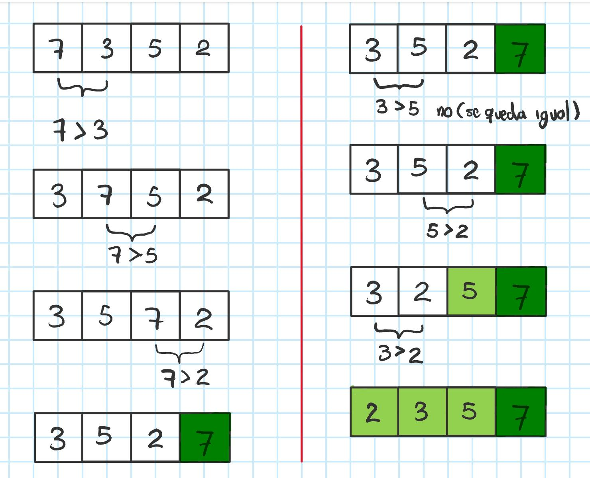
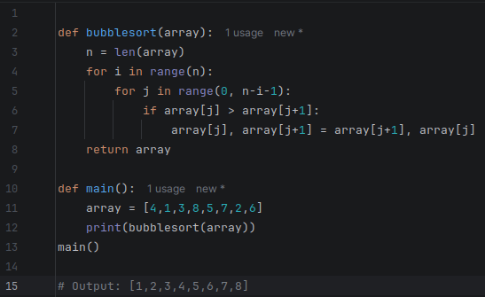
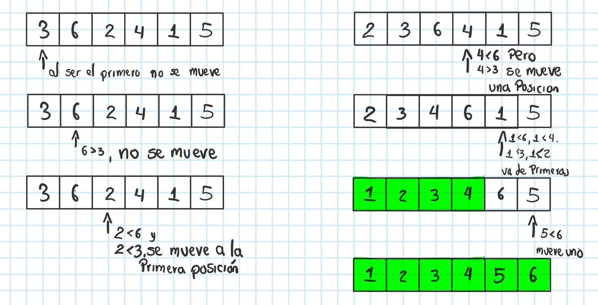
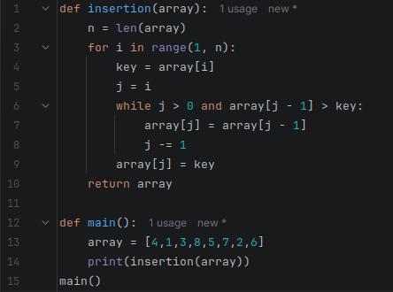
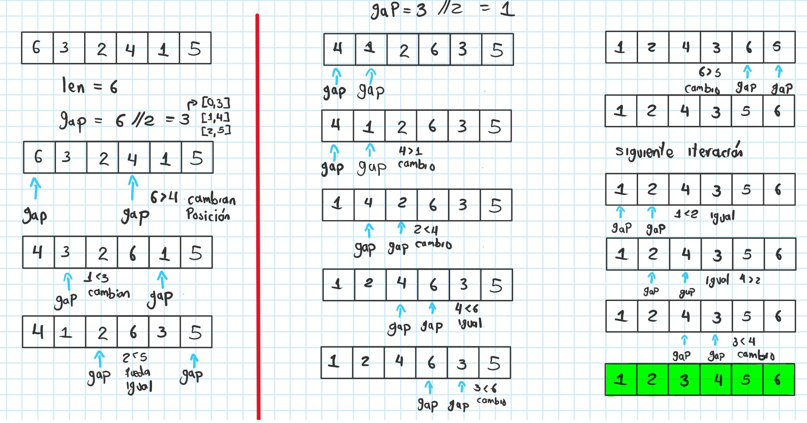
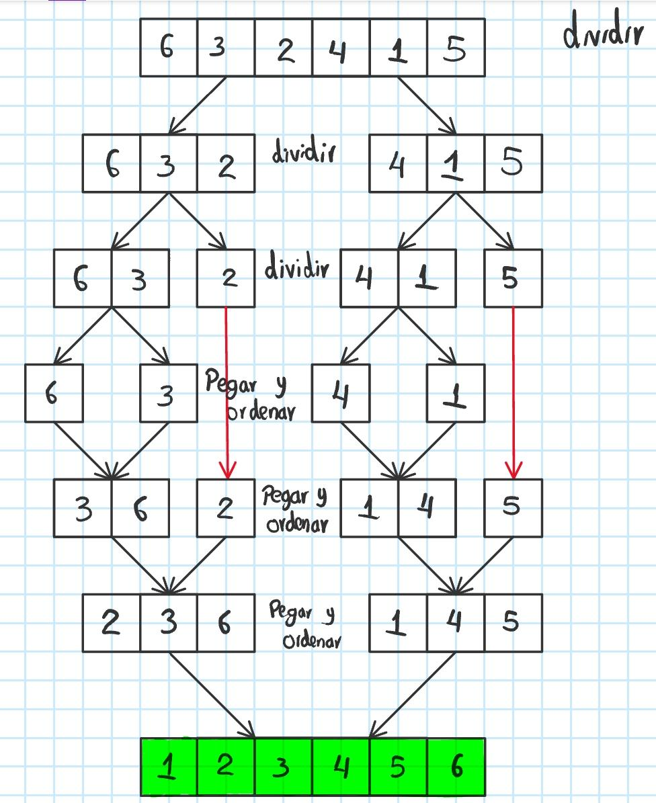
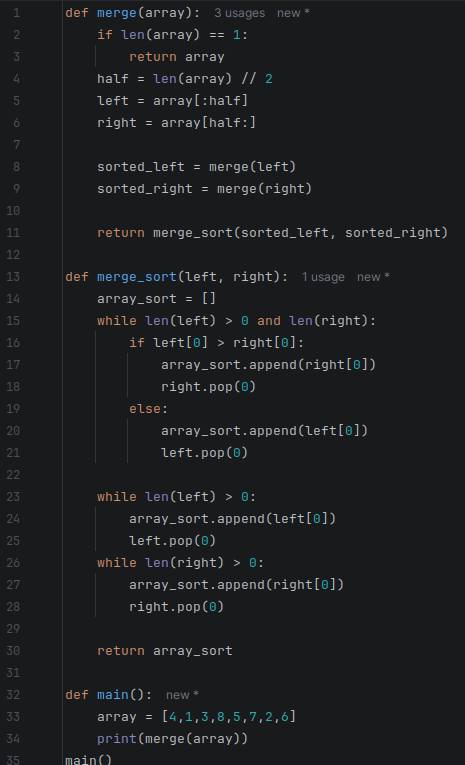
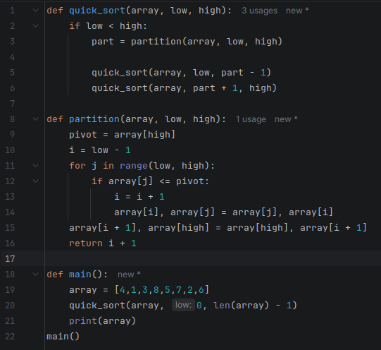

# Algoritmos de ordenamiento

La idea principal de un algoritmo de ordenamiento es que, dado un arreglo o un conjunto de elementos, se organicen de menor a mayor. Por ejemplo, transformar un arreglo como `[5, 2, 3, 1, 4]` de manera que quede como `[1, 2, 3, 4, 5]`.

Para lograr esto existen distintos algoritmos de ordenamiento que varían en la forma en que iteran para organizar los datos y en su complejidad, ya que algunos algoritmos son más eficientes que otros.

## Clasificación por eficiencia 

| Algoritmo      | Complejidad |
|:---------------|:-----------:| 
| Bubble Sort    |    O(n²)    | 
| Selection Sort |    O(n²)    | 
| Insertion Sort |    O(n²)    |
| Merge Sort     | O(n log(n)) |
| Quick Sort     | O(n log(n)) |
| Heap Sort      | O(n log(n)) |

Vamos a analizar cada algoritmo del menos al más eficiente, a excepción de Heap Sort, ya que este se encuentra enfocado en árboles binarios los cuales se verán más adelante, por lo que en ese algoritmo no se enfocara.

**NOTA:** Cada algoritmo tendrá su propia implementación dentro del `README.md`; sin embargo, la explicación detallada del código estará en su respectivo informe en formato `.ipynb` además de estar el código `.py`, cada uno estará en la carpeta `Algoritmos` en la carpeta con su respectivo nombre.

## Bubble Sort (Ordenamiento Burbuja)

Se le llama burbuja, ya que sus elementos "burbujean" hasta el final de la estructura. Es el algoritmo menos eficiente de todos, por lo que actualmente se utiliza principalmente como ejercicio de aprendizaje y práctica. Su funcionamiento, dada una lista desordenada, se puede dividir en cuatro etapas:

1. Se compara el primer elemento con el segundo; si el primer elemento es mayor que el segundo, se intercambian.
2. Se avanza al siguiente par de elementos y se repite el proceso de comparación e intercambio.
3. Este proceso se repite hasta llegar al final de la lista. Una vez completado, se puede asegurar que el último elemento es el más grande de la lista.
4. Se repiten los pasos de la primera a la tercera etapa; sin embargo, en cada nueva iteración se ignora la última posición alcanzada, ya que los elementos más grandes ya se encuentran en su posición final.

Ejemplo gráfico:



Aquí se puede observar cómo se compara cada pareja de elementos, verificando que si el primer valor es mayor al segundo, este se intercambia hasta que la lista esta ordenada.

### Implementación:




https://github.com/user-attachments/assets/34443e18-f77e-4ee4-924e-6dab5db8f060

**NOTA:** En el video se ve una implementación parecida, su diferencia es que usa un swapped el cual se usa generalmente para verificar que la lista ya está ordenada y se detenga el proceso.

### Material adicional

[](https://www.youtube.com/watch?v=pqZ04TT15PQ&t=30s)


-------

## Selection Sort

Consiste en como dice su nombre seleccionar un elemento, ya sea el elemento más pequeño o el más grande, de manera que se vaya comparando con los demás mientras se itera la lista, en caso de encontrar un elemento más pequeño o grande desentendiendo el caso que se esté usando, este se reemplaza con el elemento encontrado, y asi sucesivamente hasta recorrer toda la lista, en ese caso el elemento seleccionado se lleva al principio o final de la lista, una vez ahi se vuelve a realizar el mismo proceso ignorando el elemento ordenado.

Ejemplo grafico:


Aquí se observa que primero se selecciona el elemento como el min, ya que es el unico revisado; sin embargo, mientras se recorre la lista, se busca un nuevo minimo hasta que se encuentra el elemento más pequeño, una vez encontrado y finalizado el recorrido, ese elemento se lleva al principio de la lista y se intercambia con el elemento que se encuentra en esa posición, en caso de que el elemento se encuentre justo en su posición, entonces este se queda inmóvil, se repite el proceso para cada elemento hasta que la lista quede arreglada.

### Implementación


https://github.com/user-attachments/assets/d8796d12-ab31-425c-a851-4c1aa8a2d0d0

### Material adicional

[](https://www.youtube.com/watch?v=Myy-eU-SWbE&list=PLfBtpqIBIz7qyXl8TK8KPHYylRVlvIFY8&index=2)

----

## Insertion Sort

Este algoritmo organiza los elementos de forma natural, es decir como las personas lo hacen para organizar cosas como una mano de cartas, consiste en ir ordenando un elemento a la vez, comparando con los anteriores para ver en que posicion debe ir y asi sucesivamanete hasta organizar toda la lista.

Ejemplo grafico:



### Implementación



https://github.com/user-attachments/assets/7a11003d-a263-4cd9-bb77-45b9bd970fab

### Material adicional

[](https://www.youtube.com/watch?v=6GU6AGEWYJY&t=2s)

----

## Shell Sort

Este es uno de los algoritmos menos conocidos, ya que es como una especie de Insertion Sort mejorado, este consiste en comparar elementos de manera iterativa de saltos llamada gap, en este se define la distancia del salto, generalmente esta es de la longitud de la mitad de la lista, ahi se comparan elementos separados por esa distancia y se intercambian si el que está a la izquierda es mayor que el de la derecha.

Una vez finalizada la iteración, se realiza nuevamente el recorrido pero ahora el gap o la distancia se reduce a la mitad, asi hasta que la distancia es de solo 1 elemento, donde se itera hasta terminar de ordenar la lista.

Ejemplo grafico:



### Implementación

````
def shell_sort(arr):
    n = len(arr)
    gap = n // 2
    while gap > 0:
        for i in range(gap, n):
            temp = arr[i]
            j = i
            while j >= gap and arr[j - gap] > temp:
                arr[j] = arr[j - gap]
                j -= gap
            arr[j] = temp
        gap //= 2
    return arr
````

### Material adicional

[](https://www.youtube.com/watch?v=bJ-LWnpyx6s)

---
## Merge Sort

Es uno de los algoritmos más populares, asi mismo, es más eficiente que los algoritmos anteriores, ya que este usa el principio de dividir y conquistar, tema que se abordara con mayor profundidad más adelante en otro repo, por el momento podemos decir que consiste en agarrar un problema e irlo dividiendo en el mismo problema, sin embargo, este se va haciendo cada vez más pequeño y manejable.

Concretamente, para este problema, lo que se hace, es dividir la lista a la mitad de manera recursiva hasta que cada elemento se encuentra solo, es decir que cada elemento sea una lista propia, una vez separados se van uniendo nuevamente, sin embargo, se unen de manera ordenada hasta unir todos los elementos nuevamente en una lista, pero ya ordenados.

Ejemplo grafico:



### Implementación



### Material adicional

[](https://www.youtube.com/watch?v=ACFZn_xQcz8&t=390s)

---

## Quick Sort

Quick Sort es un algoritmo de ordenamiento basado de igual manera en la estrategia se divide y vencerás. Su idea es elegir un elemento llamado pivote y reorganizar el arreglo de manera que todos los elementos menores queden a su izquierda y todos los mayores a su derecha. Una vez el pivote queda en su posición correcta, el problema se divide en dos sub arreglos más pequeños (izquierda y derecha), y se repite el mismo proceso sobre cada uno de ellos hasta que todos los elementos quedan ordenados. Lo importante es que Quick Sort no ordena directamente todo el arreglo, sino que va colocando pivotes en su posición definitiva y reduciendo el problema recursivamente.

Ejemplo grafico:


Ahora para cada sub arreglo:


### Implementación:



https://github.com/user-attachments/assets/1801d99a-7105-42e1-b1da-f6bec106282e

### Material adicional

[](https://www.youtube.com/watch?v=UrPJLhKF1jY)
