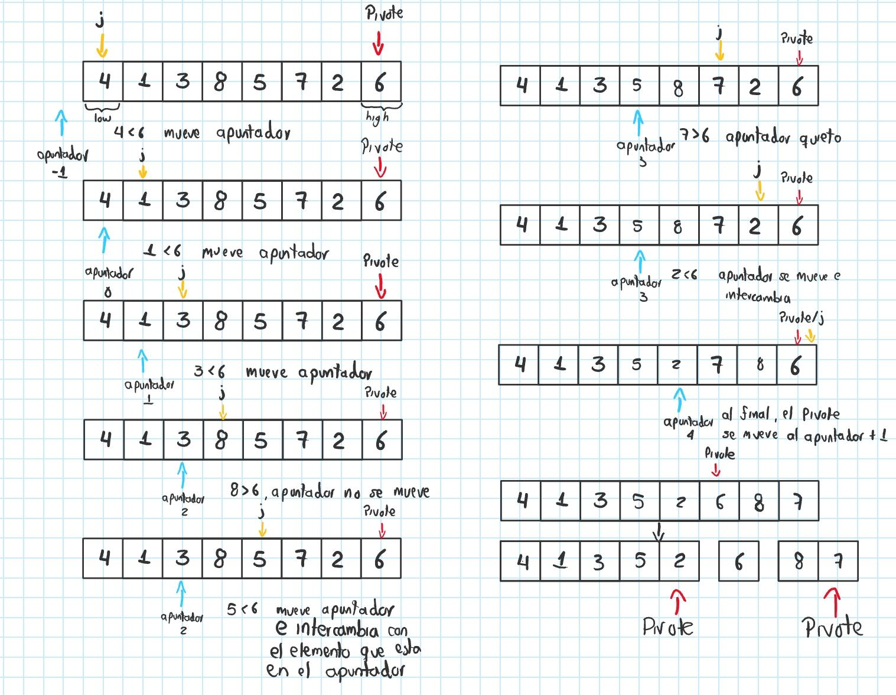
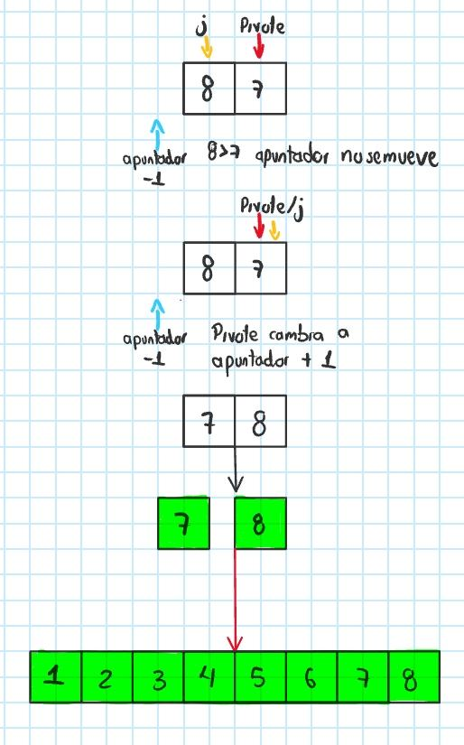
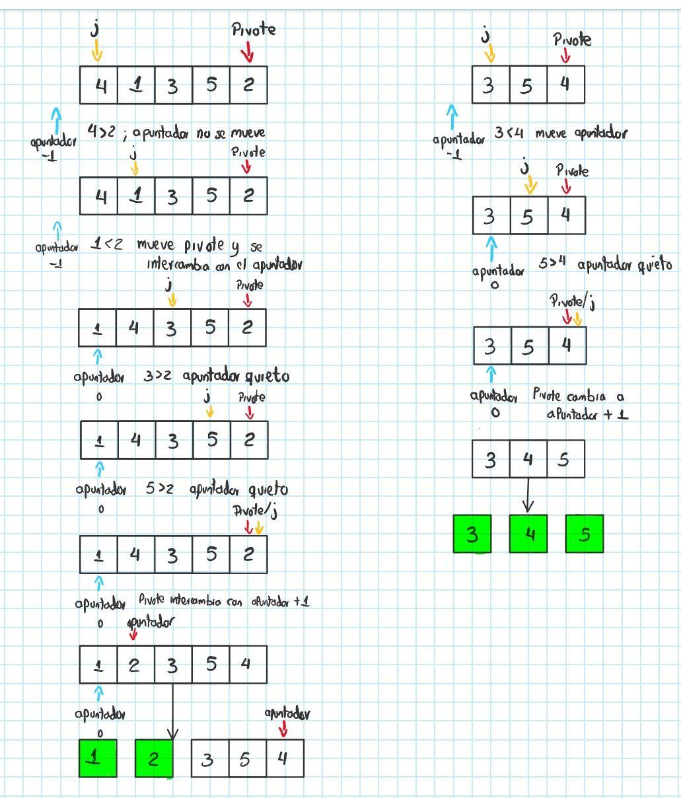
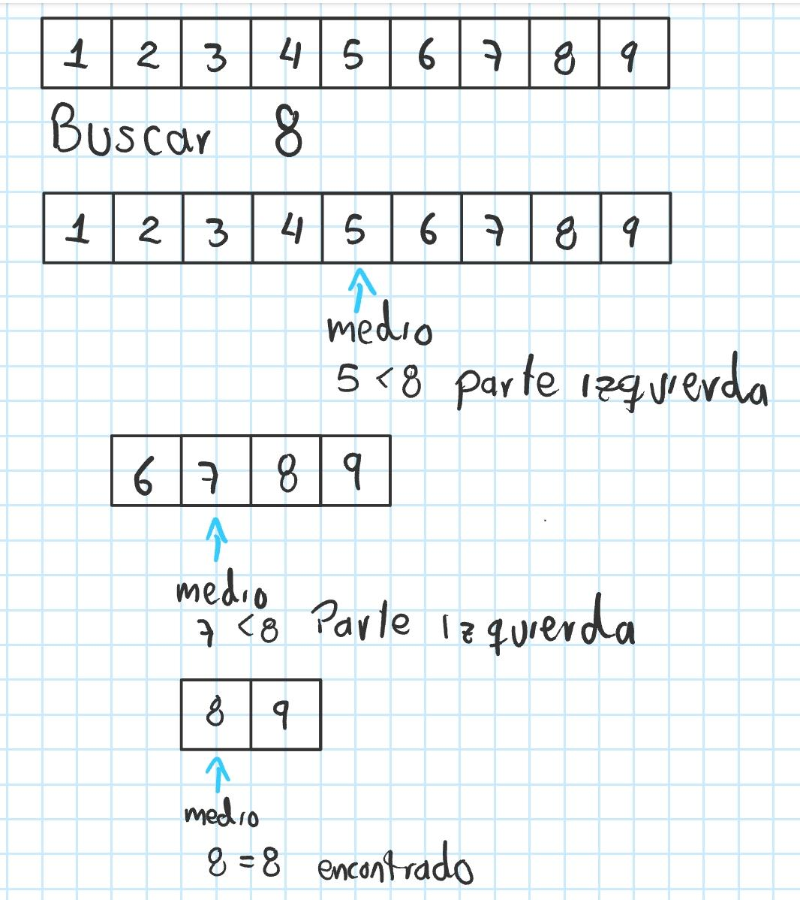
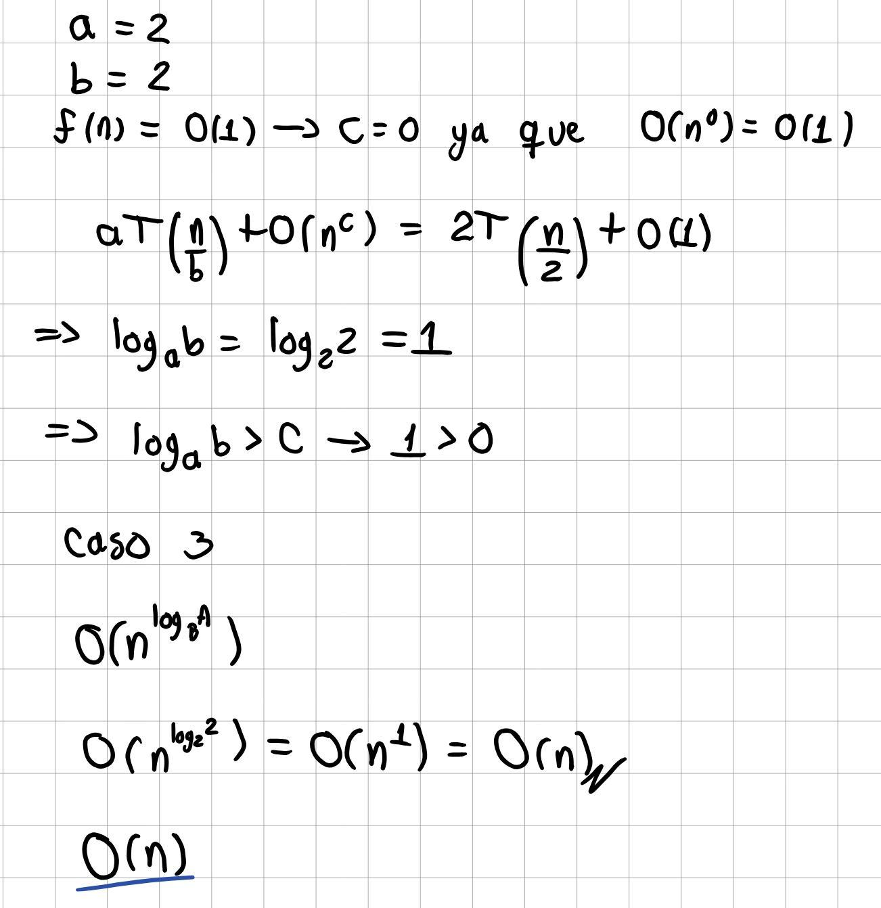

# Dividir y conquistar

---

Dividir y conquistar es una estrategia para resolver problemas grandes convirtiéndolos en problemas pequeños, asi mismo, esta sigue 3 pasos para su realización:

1. Dividir el problema en problemas más pequeños (dividir).
2. Resolver esos problemas pequeños (conquistar).
3. Combinar las soluciones para obtener el resultado final (combinar).

Esta estrategia se usa generalmente en problemas recursivos o de hacer un mismo paso varias veces. Un ejemplo sencillo para entender como funciona es:

Tengo que ordenar 1000 hojas de papel, la opción más obvia a simple viste es tomar todas las hojas y ordenarlas al mismo tiempo, aunque puede funcionar puede ser demasiado demorado.

Hay es donde entra dividir y conquistar, ya que usando esta estrategia se puede hacer algo como:

1. Separar las hojas en grupos de 100, 50, 200 o las que uno desee (dividir).
2. Ordenar cada grupo por separado (conquistar). 
3. Juntar los grupos ya ordenados (combinar).

Con esto el trabajo que se realiza es mucho menor y más manejable.

---

## Usos en algoritmos

Dividir y conquistar también se utiliza en algoritmos para hacer que tareas grandes o pesadas se vuelvan más llevaderas para el código, como bajar su tiempo de ejecución o su gasto de memoria.

Entre los principales algoritmos que lo utilizan están algoritmos de ordenamiento como merge sort o quick sort, asi como algoritmos de búsqueda como Binary Search. Los cuales usan este principio para reducir drásticamente el trabajo que tienen que realizar, de hecho, varios de los algoritmos que usan dividir y conquistar suelen ser de los más eficientes en términos de ejecución en comparación con los demás algoritmos de su misma índole.

---

### Cuando se usa 

Este generalmente se usa cuando un problema se puede dividir en partes más pequeñas e iguale mente similar, que esas partes más pequeñas sean más fáciles de resolver y que al combinar los resultados no sea demasiado costoso.

---

## Algoritmos más conocidos que usan dividir y conquistar 

### Merge Sort

Ya que este algoritmo organiza la lista de la siguiente manera, primero divide el arreglo en dos mitades, ordena cada mitad de forma recursiva y luego combina ambas mitades mediante el proceso de fusión (merge) para obtener el arreglo completamente ordenado.


```
def merge(array):
    if len(array) == 1:
        return array
    half = len(array) // 2
    left = array[:half]
    right = array[half:]

    sorted_left = merge(left)
    sorted_right = merge(right)

    return merge_sort(sorted_left, sorted_right)

def merge_sort(left, right):
    array_sort = []
    while len(left) > 0 and len(right):
        if left[0] > right[0]:
            array_sort.append(right[0])
            right.pop(0)
        else:
            array_sort.append(left[0])
            left.pop(0)

    while len(left) > 0:
        array_sort.append(left[0])
        left.pop(0)
    while len(right) > 0:
        array_sort.append(right[0])
        right.pop(0)

    return array_sort
```

Este es el código completo, de igual manera todos los códigos estarán en la carpeta "Algoritmos", por lo que vamos paso a paso con el análisis.

Primero, dividimos el arreglo en 2 mitades iguales.

```
if len(array) == 1:
        return array
    half = len(array) // 2
    left = array[:half]
    right = array[half:]
```

Segundo, organizamos cada sub arreglo de manera recursiva.

```
    sorted_left = merge(left)
    sorted_right = merge(right)
```

Tercero, se juntan ambas mitades para volver a la lista original pero ya ordenada.

```
    array_sort = []
    while len(left) > 0 and len(right):
        if left[0] > right[0]:
            array_sort.append(right[0])
            right.pop(0)
        else:
            array_sort.append(left[0])
            left.pop(0)

    while len(left) > 0:
        array_sort.append(left[0])
        left.pop(0)
    while len(right) > 0:
        array_sort.append(right[0])
        right.pop(0)

    return array_sort
```

---

### Quick Sort

Este algoritmo de ordenamiento también usa divide y conquistar, ya que este divide el arreglo alrededor de un pivote, ordena recursivamente las particiones resultantes y luego reconstruye el arreglo ordenado a partir de dichas particiones.



Parte Derecha:



Parte Izquierda:



```
def quick_sort(array, low, high):
    if low < high:
        part = partition(array, low, high)

        quick_sort(array, low, part - 1)
        quick_sort(array, part + 1, high)

def partition(array, low, high):
    pivot = array[high]
    i = low - 1
    for j in range(low, high):
        if array[j] <= pivot:
            i = i + 1
            array[i], array[j] = array[j], array[i]
    array[i + 1], array[high] = array[high], array[i + 1]
    return i + 1
```

Entonces, en este caso antes de empezar con lo tipico de dividir y conquistar, primero tenemos que "organizar" los menores y mayores al pivote en sus respectivos lados.

```
part = partition(array, low, high)
```

Una vez hecho esto, ahora si empieza dividir y conquistar, ya que se divide la lista en 2 sublistas, una con los mayores al pivote y otra con los menores.

```
        quick_sort(array, low, part - 1)
        quick_sort(array, part + 1, high)
```

Después, a cada parte le volvemos a realizar el proceso de organizar menores y mayores respecto al pivote, es decir el primer paso antes de dividir se vuelve a realizar, asi, hasta finalizar con la lista ya ordenada.

```
pivot = array[high]
    i = low - 1
    for j in range(low, high):
        if array[j] <= pivot:
            i = i + 1
            array[i], array[j] = array[j], array[i]
    array[i + 1], array[high] = array[high], array[i + 1]
    return i + 1
```

---

### Binary Search

Esta es una de las mejores maneras de encontrar un elemento, lo que hace este algoritmo es dado una lista ordenada (ya que si la lista está desordenada el algoritmo no sirve) y un elemento que se quiere encontrar, se retorna su posición o índice.

Para encontrar dicho elemento esta busca el elemento de la mitad de la lista y compara si es igual, es mayor o menor, en caso de ser igual, para ya que se encontró el elemento, si es mayor se divide la lista desde el elemento de la mitad hasta el final, y en caso de ser menor se divide la lista desde el primer elemento hasta el elemento de la mitad, y se realiza el mismo proceso sucesivamente hasta encontrar dicho elemento.



A pesar de sonar más complejo que simplemente hacer un `for` a la lista y parar hasta encontrar el elemento, de hecho, binary search tiene una complejidad de $O(log(n))$, siendo menor a la complejidad de una iteracion for de $O(n)$.

```
def binary_search(array, number):
    left = 0
    right = len(array) - 1
    while left <= right:
        half = (left + right) // 2
        if number == array[half]:
            return half
        elif number > array[half]:
            left = half + 1
        else:
            right = half - 1
    return -1
```

Entonces, este algoritmo usa dividir y conquistar de manera que en caso de que el elemento no este en la mitad, entonces este compara si el elemento es mayor o menor al elemento medio para elegir como dividir la lista, asi hasta conquistar o encontrar ese elemento.

---

### Encontrar el máximo y el minimo de un arreglo

Este algoritmo es bastante sencillo, como lo dice su nombre es encontrar el elemento máximo y minimo de una lista, esto sin usar las respectivas funciones max() ni min().

A primera vista la solución más sencilla es utilizar un ciclo `for` para recorrer toda la lista, sin embargo, usando dividir y conquistar lo que hacemos es al igual que `merge sort` divide la lista de manera recursiva hasta que todos los elementos queden separados, una vez ahi se comparan los elementos para encontrar cuál es menor y el mayor de cada lado. Una vez encontrado, se vuelve a comparar el menor de cada lado para encontrar el menor y comparar ambos mayores para encontrar el mayor de la lista.

```
def max_min(array, left, right):
    if left == right:
        return array[left], array[left]
    half = (left + right) // 2

    max_left, min_left = max_min(array, left, half)
    max_right, min_right = max_min(array, half + 1, right)

    if max_left > max_right:
        max = max_left
    else:
        max = max_right

    if min_left < min_right:
        min = min_left
    else:
        min = min_right

    return max, min
```

Este algoritmo al ser recursivo, se debe usar teorema maestro, ya está explicado como se calcula [Aquí](https://github.com/JDavid-Moreno/Teorema-Maestro.git). Pero, rápidamente podemos calcularlo encontrando $a, b$ y $c$.

El problema se divide en 2 subproblemas, por lo que $a = 2$, cada subproblema solamente abarca la mitad del arreglo, o sea $b = 2$, y finalmente el trabajo que se realiza fuera de la recursión es únicamente de condicionales, que son de complejidad $O(1)$, o sea $c = 0$, ya con estos datos podemos calcular la complejidad.



---

## Material Adicional

[](https://www.youtube.com/watch?v=UxtAqHOb8aw)

[](https://www.youtube.com/watch?v=dxWhOgVlKoA)


