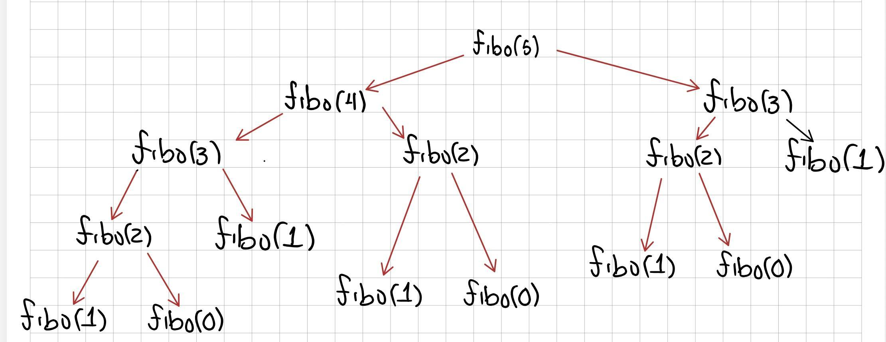
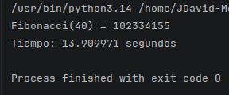
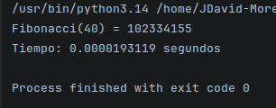
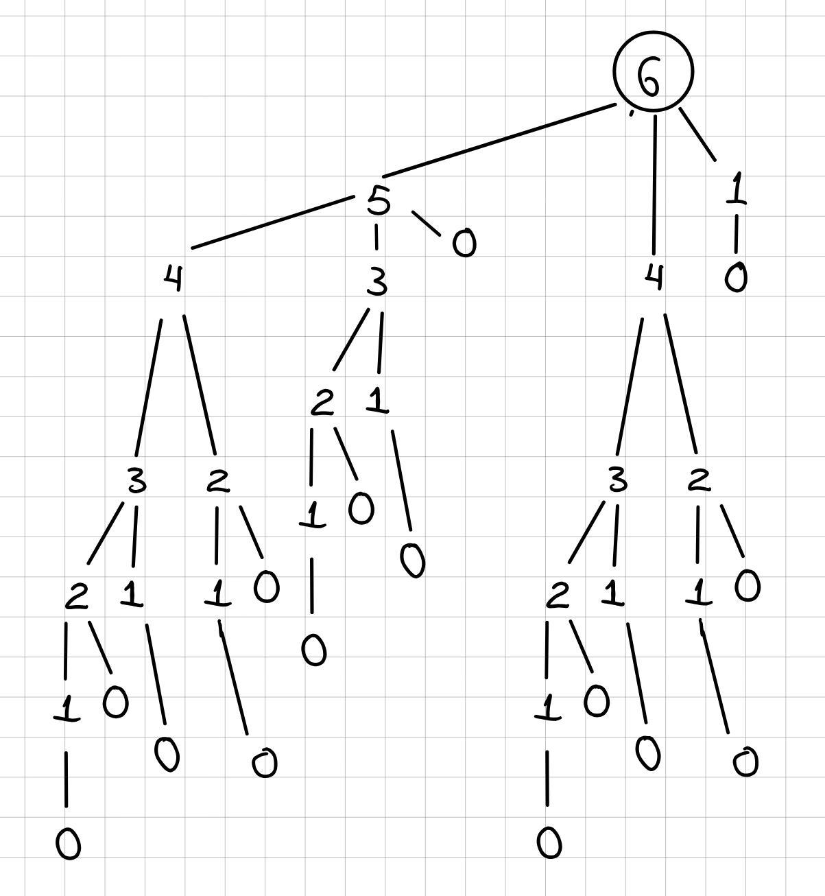
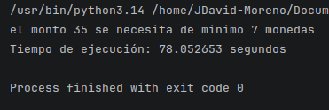
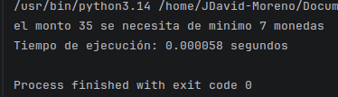
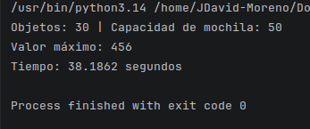
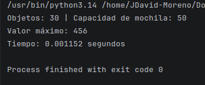

# Programación Dinámica

---

## Que es?

Es una técnica de diseño de algoritmos que consiste en resolver problemas complejos dividiéndolos en subproblemas más pequeños, la diferencia es que guarda los resultados de esos subproblemas para no necesitar calcularlos nuevamente. 

Su función principal es optimizar, ya que transforma algoritmos que sin programacion dinámica serían muy lenta (crecimiento exponencial) en algoritmos más rápidos (crecimiento lineal o polinómico). Es decir, en lugar de desperdiciar tiempo procesando una y otra vez, la programacion dinámica usa memoria para optimizar y que sea más rapido.

---

## ¿Cuándo se usa?

Para poder aplicar programación dinámica, el problema debe cumplir con dos condiciones:

1. subproblemas superpuestos (Overlapping Subproblems): El problema se puede dividir en subproblemas más pequeños, y esos mismos subproblemas se repiten varias veces durante el cálculo.
2. Substructure óptima (Optimal Substructure): La solución óptima al problema global se puede construir a partir de las soluciones óptimas de sus subproblemas.

---

## Como funciona?

Programación dinámica cuenta con 2 enfoques distintos:

1. Memorización (Top-Down): Este utiliza la estructura recursiva, pero antes de calcular algo, se revisa si ya se guardó en una tabla (que puede ser una lista o un diccionario).
2. Tabulación (Bottom-Up): Este es iterativo, o sea empieza desde los casos más pequeños o los casos base, y se va llenando una tabla hacia arriba hasta llegar al resultado deseado. 

---

## Ejemplos

**NOTA:** Cada ejemplo tendrá su respectiva implementación en python en la carpeta [Algoritmos](https://github.com/JDavid-Moreno/Programacion-Dinamica/tree/main/Algoritmos). 

### Fibonacci 

Este es de los más conocidos, la secuencia de fibonacci consiste en que para encontrar un valor tenemos que sumar los dos elementos anteriores, con base que los primeros dos elementos son 0 y 1, es decir, que fibonacci(0) es 0 y fibonacci(1) es 1, y de ahi se hace la suma.

Por ejemplo, fibonacci(2) es la suma de los anteriores, o sea, fibonacci(1) + fibonacci(0), que es $1 + 0 = 1 $, por lo que, $fibonacci(2) = 1 $.

La manera más sencilla de encontrar cualquier valor de fibonacci es usando recursión, llamando a la misma función pero sumando los valores anteriores.

```
def fibo(n):
    if n <= 1:
        return n
    return fibo(n - 1) + fibo(n - 2)
```

De esta manera, a pesar de ser corto, es sumamente deficiente, ya que por ejemplo, si queremos encontrar $fibonacci(5) $, como se puede observar:



Cada vez que se llama a la funcion anterior, se repite trabajo, siendo que por ejemplo $fibonacci(1)$ se llama 5 veces, y mientras más grande sea el valor de fibonacci, más trabajo repetitivo se hace, es por eso que la complejidad de este algoritmoe es de $O(2^n)$ siendo muy lento el programa.

Aquí es cuando entra la programacion dinámica, que usando cualquiera de sus 2 metodos mejora grandemente la eficiencia del código.

**Usando memorización:**

```
def fib(n, memo):
    if n in memo:
        return memo[n]
    if n <= 1:
        return n

    memo[n] = fib(n-1, memo) + fib(n-2, memo)
    return memo[n]
```

Aquí se usa un diccionario global el cual va guardando los resultados de las iteraciones, esto para que al momento de buscar un valor de fibonacci, si ese valor ya se encuentra en el diccionario, este ya no tenga que calcularlo, sino únicamente tomarlo del diccionario y ya, esto acorta mucho la complejidad del algoritmo a $O(n)$.

**Usando Tabulación:**

```
def fib(n):
    if n <= 1:
        return n

    table = [0] * (n + 1)
    table[1] = 1
    for i in range(2, n + 1):
        table[i] = table[i - 1] + table[i - 2]
    return table[n]
```

Aquí lo que hacemos es usar una tabla o mejor dicho una lista, esta lista tendrá un tamaño de $n + 1$ elementos, esto es, ya que evaluaremos desde $0$ a $n$, o sea si $n = 5$ entonces la lista será: `[0,0,0,0,0,0]`, una vez creada le ingresamos sus valores fijos o base que son el 0 el cual por defecto ya está y el 1 en su respectiva posición.

Una vez con eso podemos realizar una iteración simple usando un ciclo `for` desde el siguiente elemento después del caso base, en este caso 2 hasta el final de la lista, donde para encontrar el elemento siguiente, usamos la suma de fibonacci normal, sumamos los 2 valores anteriores para encontrar el siguiente.

Aquí la diferencia, es que, al hacerlo en una lista con los valores y no de manera recursiva la complejidad baja de igual manera a $O(n)$, siendo mucho más eficiente que por recursividad normal.

Tiempo de ejecución con recursividad normal / Tiempo de ejecución con Tabulación:




Como se ve, el tiempo de ejecución bajo exageradamente, pasando de más de 10 segundos a menos de 1 milisegundo de ejecución.

https://github.com/user-attachments/assets/3e3f5a08-0bbe-4783-a94a-a0b56226e89c

---

### Cambio de monedas

Consiste en encontrar la menor cantidad de monedas posible para sumar una cantidad determinada de dinero, utilizando un conjunto de valores de monedas disponibles.

Es decir, si tengo 12 centavos, cuál es la cantidad minima de monedas que necesito para completar esos 12 centavos, no importa la denominación (a menos que sea solicitada) sino únicamente la cantidad.

La manera más sencilla y a la vez la menos eficiente que es usando fuerza bruta, es utilizando recursion de manera que, se busque cuál fue la cantidad minima de monedas de los valores anteriores, los valores a comparar son el valor del monto menos los valores de las monedas.

Por ejemplo, si tengo las monedas de valor $1, 2$ y $5$, si quiero saber cuál es la cantidad minima de monedas de 6 centavos, reviso los valores que cumplan que sea el monto menos cada tipo de moneda:

$6 - 1 = 5$

$6 - 2 = 4$

$6 - 5 = 1$

Una vez identificados los valores previos, reviso cuál de estos me da la minima cantidad de monedas y a esta cantidad le sumo uno (de la moneda a agregar para llegar al monto deseado), esto se hace de manera recursiva hasta tener los valores previos y asi encontrar el minimo.

```
def coin_change(amount, coins):
    if amount == 0:
        return 0
    if amount < 0:
        return float('inf')

    minimum = float('inf')
    for coin in coins:
        minimum = min(minimum, coin_change(amount - coin, coins) + 1)

    return minimum
```

Podemos observar que ya cuenta con los casos bases que si hay 0 monedas, pues ahi 0 formas de hacerlo, asi mismo, el caso donde el monto sea negativo donde revuelve con indeterminado, ya que un monto negativo técnicamente es imposible por lo que no se realiza recursion.

Por otro lado, para encontrar el valor se llama nuevamente a la funcion, sin embargo, con el monto modificado como ya se explicó, esta forma es sumamente lenta, ya que realiza calculos repetitivos varias veces como se ve:



Donde por ejemplo con 6, se realiza 8 veces el cálculo de 1 centavo, lo cual hace que la complejidad se vaya a $O(m^n)$ siendo $m$ la cantidad de posibles llamadas, en este caso que tenemos 3 valores de monedas, $m = 3 $, por lo que la complejidad es $O(3^n)$ siendo sumamente lento, esto se arregla fácilmente usando programacion dinámica.

**Caso con memorización:**

```
def coin_change(amount, coins, memo):
    if amount in memo:
        return memo[amount]
    if amount == 0:
        return 0
    if amount < 0:
        return float('inf')

    minimum = float('inf')
    for coin in coins:
        minimum = min(minimum, coin_change(amount - coin, coins, memo) + 1)
    memo[amount] = minimum
    return minimum
```

Usando esta técnica podemos ver a simple vista que es muy parecido al anterior o sea el de fuerza bruta; sin embargo, este cuenta con la diferencia de usar un diccionario, el cual va guardando los resultamos de las cantidades mínimas, esto hace que no se tenga que repetir calculos, haciéndolo sumamente menos compleja, siendo de $O(n * m) = O(n)$.

**Caso con tabulación:**

```
def coin_change(coins, amount):
    if amount < 0:
        return float('inf')
    array = [float('inf')] * (amount + 1)
    array[0] = 0

    for i in range(1, amount + 1):
        for coin in coins:
            if coin <= i:
                array[i] = min(array[i], array[i - coin] + 1)

    return array[amount]
```

Como tabulación es iterativo, este utiliza dos ciclos `for`, aca creamos una tabla o lista la cual va a ser de tamaño $valor + 1 $, es decir, si el valor es de 6, la lista será de tamaño 7, ya que necesitamos saber los valores de 0 a n. 

Esta lista a diferencia de $fibonacci$ se llena con $inf$ o indeterminado en vez de 0, ya que en caso de hacer una lista de 0 s, esta no servirá, ya que al hacer `min()` siempre será 0.

Por otro lado, los ciclos `for`, uno se encarga de ir recorriendo todos los valoré excepto el 0 el cual ya está agregado desde antes de iterar, hasta el último elemento o sea el valor a encontrar, el otro se encarga de recorrer la lista de monedas dadas para comparar con los valores previos.

Este algoritmo, de igual manera es de complejidad $O(n * m)$, ya que cada ciclo `for` recorre una lista diferente, asi mismo, la lista de monedas que se itera $m$ veces generalmente se da, es decir, el problema nos da de antemano la cantidad de monedas, por lo que su complejidad final es de $O(n)$, siendo mucho más eficiente que por fuerza bruta

Tiempo de ejecución con recursividad normal:



Tiempo de ejecución con Memorización:



---

### Knapsack (Mochila).

Este problema consiste en que tengo una mochila o maleta, la cual tiene cierta cantidad de espacio para guardar una cantidad $n$ de objetos, cada objeto tiene un cierto valor, la idea es maximizar el valor total que puede llevar la maleta sin sobrepasar la capacidad maxima.

Para cada objeto tenemos 2 posibles opciones: 

1. Dejar el objeto y pasar al siguiente.
2. Tomar el objeto, sin embargo, ahora tengo menos capacidad en la mochila.

La manera más sencilla de abordar este problema es con recursión:

```
def backpack(capacity, weights, values, n):
    if n == 0 or capacity == 0:
        return 0

    if weights[n - 1] > capacity:
        return backpack(capacity, weights, values, n - 1)

    return max(backpack(capacity, weights, values, n - 1),
               values[n - 1] + backpack(capacity - weights[n - 1], weights, values, n - 1))
```

Primeramente, la variable `n` representa la cantidad de objetos, la cual usaremos para "recorrer" la lista de objetos empezando desde el último hasta el primero.

Una vez con eso en cuenta, lo que hacemos es revisar primero si cada objeto tiene menor o igual a la capacidad actual de la mochila, en caso de que sea más pesado se descarta y se pasa al siguiente objeto.

Por otro lado, en caso de que el objeto pese menos que la capacidad que tenga la mochila, se tiene que buscar el máximo entre ambas opciones, es decir, el que de más valor total entre dejar el objeto y mirar el siguiente, o tomar el objeto y ver los demás objetos pero ahora con menos capacidad.

Este proceso se realiza de manera recursiva hasta recorrer todos los objetos o hasta que la capacidad de la mochila llegue a 0. Hacerlo de esta manera es demasiado lento, ya que su complejidad es de $O(2^n)$, esto debido a que en cada objeto debe preguntarse si tomarlo o no, o sea 2 opciones, y por cada objeto sería aproximadamente:
$2 * 2 * 2 ...$ asi $n$ veces.

**Caso con memorización:**

```
def backpack(capacity, weights, values, n, memo):
    if (capacity, n) in memo:
        return memo[(capacity, n)]

    if n == 0 or capacity == 0:
        return 0

    if weights[n - 1] > capacity:
        result = backpack(capacity, weights, values, n - 1, memo)
    else:
        result = max(backpack(capacity, weights, values, n - 1, memo),
                         values[n - 1] + backpack(capacity - weights[n - 1], weights, values, n - 1, memo))

    memo[(capacity, n)] = result
    return result
```

Ahora, usando memorización es prácticamente igual, sin embargo, al usar un diccionario, este se evita de repetir calculos o en este caso posibilidades, esto ayuda a no repetir varias veces las mismas combinaciones de objetos, de esta manera también baja la complejidad a $O(nW)$, donde $W$ representa la capacidad de la mochila y $n$ es la cantidad de objetos, por ende la capacidad al ser insignificante para la complejidad es de $O(n)$.

**Caso con tabulación:**

```
def backpack(capacity, weights, values, n):
    array = [[0] * (capacity + 1) for _ in range(n + 1)]
    for i in range(1, n + 1):
        for j in range(capacity + 1):
            if weights[i - 1] <= j:
                array[i][j] = max(array[i - 1][j], values[i - 1] + array[i - 1][j - weights[i - 1]])
            else:
                array[i][j] = array[i - 1][j]

    return array[n][capacity]
```

En este caso, tabulación es más complejo de entender, pero consiste en lo siguiente:

Primeramente, creamos una matriz o tabla llamada `array` llena de ceros, donde las filas representan la cantidad de objetos disponibles (desde 0 hasta n) y las columnas representan capacidades ficticias de la mochila que van aumentando de uno en uno desde 0 hasta la capacidad máxima real.

Una vez con eso en cuenta, lo que hacemos es utilizar dos ciclos anidados para recorrer cada celda de esta tabla, fila por fila y columna por columna. Para cada celda, revisamos primero si el peso del objeto actual es menor o igual a la capacidad de la columna en la que estamos parados. 

En caso de que sea más pesado y no quepa, copiamos directamente el valor que calculamos en la fila de arriba para esa misma capacidad, ya que no podemos incluir este objeto. Por otro lado, en caso de que el objeto actual sí quepa en la capacidad de la columna, se tiene que buscar el máximo entre ambas opciones. Es decir, comparamos el valor total de dejar el objeto (que consiste simplemente en mirar el resultado de la fila de arriba en esa misma columna) contra el valor de tomar el objeto (que consiste en sumar el valor del objeto actual más el mejor resultado que podíamos obtener en la fila anterior restándole el peso del objeto a la capacidad actual).

Este proceso se realiza de manera iterativa (llenando la tabla de abajo hacia arriba) hasta completar todas las celdas. Al final, el resultado óptimo con todos los objetos considerados y la capacidad total permitida se encontrará guardado en la última celda de la esquina inferior derecha, la cual simplemente devolvemos. 

Hacerlo de esta manera elimina por completo la recursividad y asegura una complejidad de $O(n)$, ya que cada combinación posible se calcula exactamente una sola vez de forma ordenada.

Tiempo de ejecución con recursividad normal:



Tiempo de ejecución con memorización:



---

## Material adicional

[](https://www.youtube.com/watch?v=e5zaZEfHsIs&t=992s)

[](https://www.youtube.com/watch?v=C240g6_Dsl4)

[](https://www.youtube.com/watch?v=2C2v2TT1fPc)
