# Árboles Binarios

---

Los árboles binarios son una estructura de datos no lineal, está al igual que las listas enlazadas utiliza nodos para conectar sus elementos, sin embargo, esta es una estructura jerárquica, es decir, que los nodos se manejan de manera que existe un nodo "padre" nodo raiz, y de este salen 2 nodos "hijos" o nodos ramas, y estos a su vez pueden ser nodos raiz de otros 2 nodos ramas.

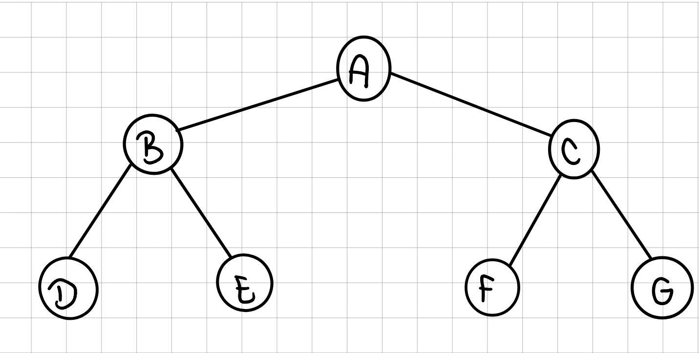

Aquí:
- A es la raiz.
- B y C son hijos de A.
- D y E son hijos de B.
- F y G son hijos de C.
- A es padre de B y C.
- B es padre de D y E.
- C es padre de F y G.
- D, E, F y G son hojas, ya que no tienen hijos.

---

## Como se construye

Al igual que una lista enlazada, la mejor manera de crear un arbol binario es mediante una clase, y es bastante parecia a como funciona una lista enlazada con la diferencia que esta necesita de dos apuntadores, ya que cada nodo tiene dos hijos.

```
class Node:
    def __init__(self, value):
        self.value = value
        self.left = None
        self.right = None
```

Como se puede observar, la clase nodo es bastante similar a la usada para listas enlazadas, sin embargo, al necesitar de 2 apuntadores, se crean dos variables para guardar los datos, en vez de una. Ahora para crear el arbol binario:

```
class BinaryTree:
    def __init__(self):
        self.root = None
```

Para únicamente crearlo, solamente necesitamos de la raiz o el primer elemento, ya con esto podemos crear las operaciones principales.

**Insertar**

```
    def insert(self, value):
        new_node = Node(value)
        if self.root is None:
            self.root = new_node
            return

        current = self.root
        while True:
            if value < current.value:
                if current.left is None:
                    current.left = new_node
                    return
                current = current.left
            else:
                if current.right is None:
                    current.right = new_node
                    return
                current = current.right
```

Aquí lo que hacemos es primero verificar si ya está el valor de la raiz, si no, el valor a ingresar será la raiz. Por otro lado, en caso ya este la raiz, debemos verificar si el valor que vamos a ingresar es mayor o menor al valor de la raiz, ya que dependiendo de este, es donde nos tenemos que mover.

Si el valor es menor al de la raiz, debemos ir por el nodo de la izquierda, y si es mayor debemos ir pot el nodo de la derecha, de igual manera, al ir por el respectivo nodo debemos repetir el mismo proceso hasta llegar a la hoja.

Ejemplo grafico:

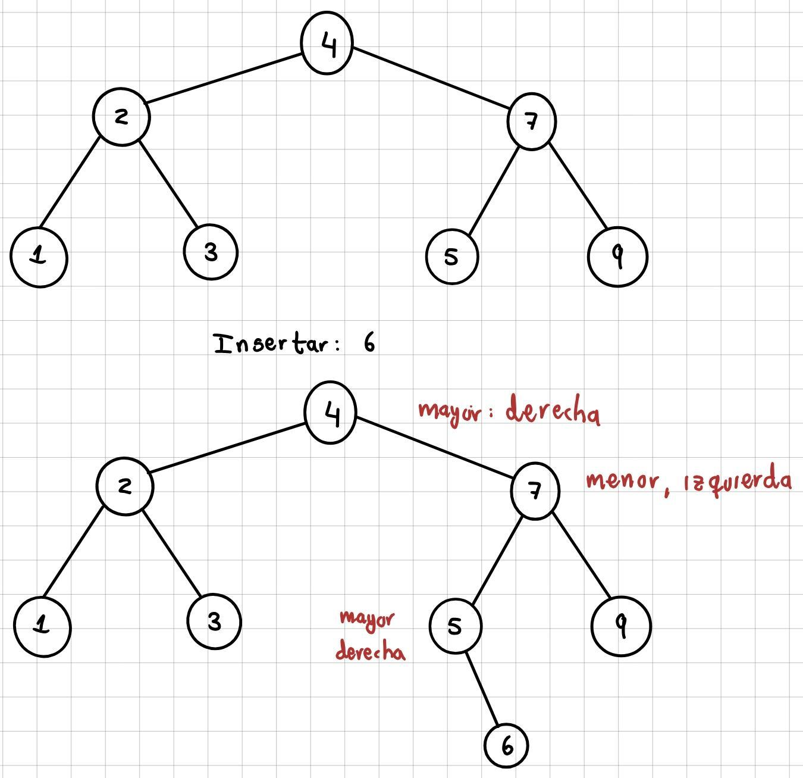

**Buscar**

```
    def search(self, value):
        current = self.root
        while True:
            if value == current.value:
                return True
            elif value < current.value:
                current = current.left
            else:
                current = current.right
        return False
```
Es bastante parecido al de insertar, ya que como árboles al ingresar elementos en orden, solamente debemos fijarnos en que elemento es mayor o menor, y dependiendo de eso, a que nodo ir hasta encontrar el valor que queremos encontrar.

Ejemplo grafico:

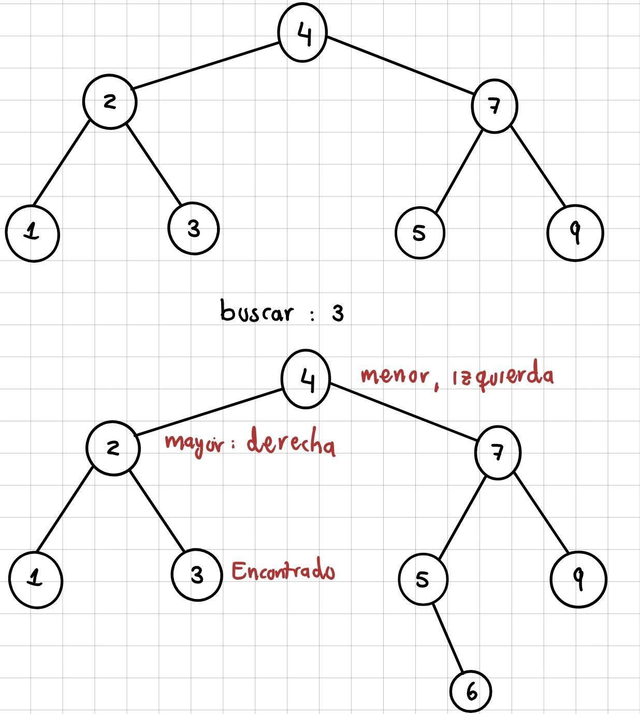

---

Ahora bien, tanto las operaciones de eliminar como de visualizar el arbol son distintas. 

Empezamos por visualizar el arbol, debido a la estructura de este la manera de leer el arbol no siempre es la misma, por lo que existen 3 maneras de leer los datos del arbol en orden, las cuales son las siguientes:

- Inorder: se lee de izquierda a derecha, o mejor dicho sigue el orden izquierda -> nodo -> derecha.
- Preorder: se lee de manera más basada en jerarquía, es decir de arriba (la raiz) hasta las hojas, nodo -> izquierda -> derecha. 
- Postorder: se lee de manera opuesta a pre orden, empezando por las hojas y siguiendo hasta la raiz, o sea izquierda -> derecha -> nodo.

Usando esta imagen de un arbol binario cualquiera, como sería el orden de los datos usando cada forma.


**Inorder:** primero recorremos el arbol hasta la hoja más a la izquierda del todo o sea D, luego seguimos con su nodo padre B, y ahi vamos a su otro hijo (si tiene), o sea C (principio izquierda -> nodo -> derecha.), una vez terminada esa rama, como ya no podemos ir a la izquierda seguimos con el nodo de B que es A, después seguimos con el nodo derecho de A, y aquí repetimos el ciclo, primero al nodo izquierdo F, después al nodo padre de este C, y finalmente el nodo derecho G.

Resultado: [D, E, B, A, C, F, G]

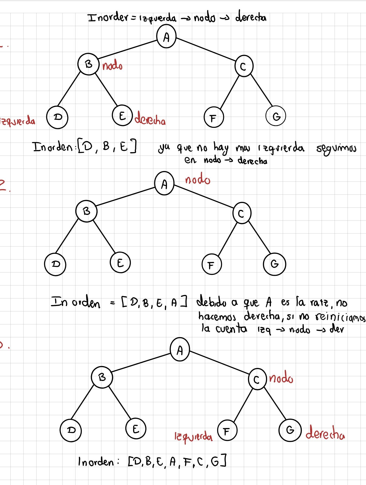

**Preorder:** Para este primero empezamos en la raiz o sea guardamos A de primeras, una vez hay primero resolvemos toda la rama de la izquierda y después toda la rama de la derecha. Entonces en la izquierda usamos el orden establecido(nodo -> izquierda -> derecha), por lo que primero guardamos la B, luego el hijo izquierdo D y después el hijo derecho E.

Una vez con toda la rama izquierda hecha, pasamos a la rama Derecha y seguimos el mismo orden, primero el nodo C, luego el hijo izquierdo F y finalmente el hijo derecho G.

Resultado: [A, B, D, E, C, F, G]

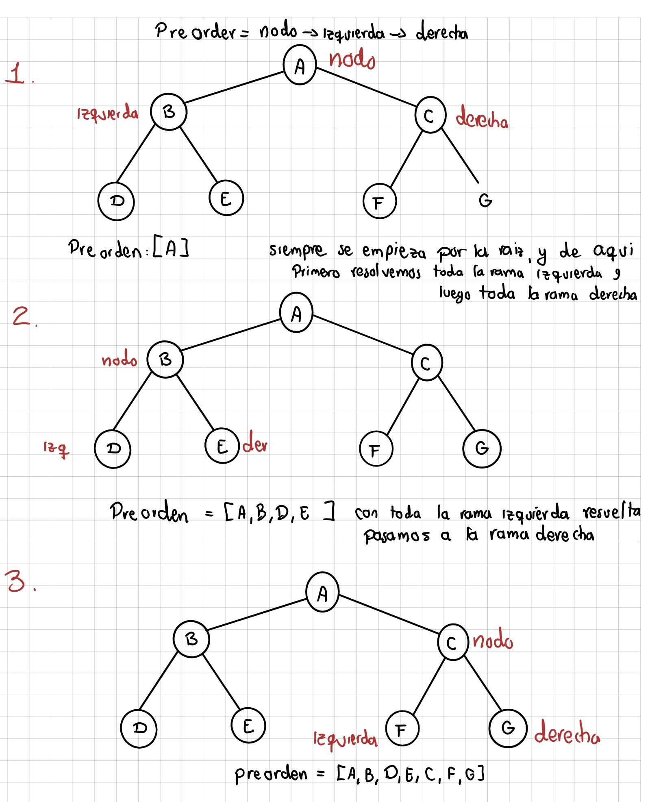

**Postorder:** Para este bajamos a la hoja más a la izquierda, en este caso D, después seguimos con su "hermana" de la derecha E, aquí, ya seguimos con el nodo padre B, sin embargo, al haber terminado toda la rama izquierda, seguimos de largo la raiz y seguimos directamente a la rama derecha siguiendo el orden (izquierda -> derecha -> nodo).

Por lo que seguimos con la hoja izquierda F, luego la hoja derecha G y el nodo padre C, finalmente después de terminar ambas ramas acabamos con la raiz A.

Resultado: [D, E, B, F, G, C]

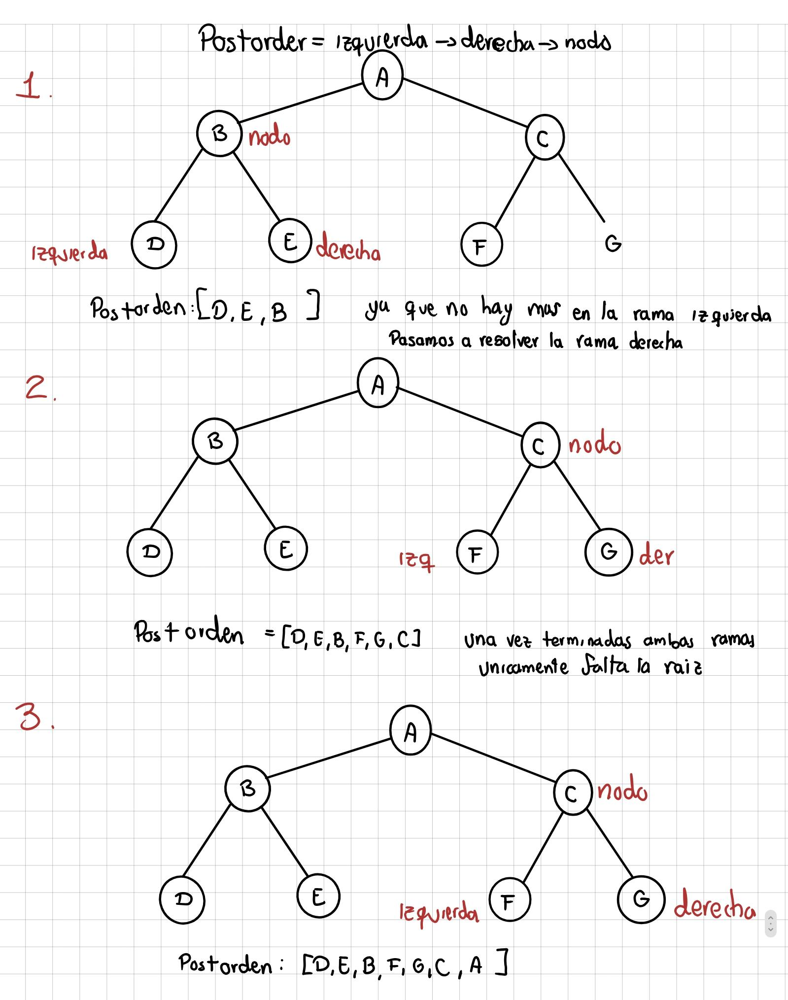

https://github.com/user-attachments/assets/37cde04f-829b-48a4-b0e8-b4b55dea66c1

### Implementación

Implementando esto en nuestro código, ahi varias maneras de hacerlo, la mejor por sencillez a la hora de llamar la clase sería usando un metodo auxiliar.

```
    def inorder(self):
        self._inorder(self.root)

    #función auxiliar
    def _inorder(self, node):
        if node is None:
            return
        self._inorder(node.left)
        print(node.value)
        self._inorder(node.right)
```

La función consiste en usar recursión para volver a llamar al método para recorrer el arbol en su totalidad siguiendo los pasos de inorder (izquierda -> nodo -> derecha).

https://github.com/user-attachments/assets/ee014084-284d-4ba6-8f3b-3f945172e15a

> [!NOTE]
> **Nota:** Las funciones auxiliares nos permiten que al llamar o instanciar la clase arbol, al querer ver la lista con inorder, preorder o postorder, solamente tengamos que hacer algo como.
> ```
> tree = BinaryTree()
> # insertamos los valores al arbol
> tree.inorder()
> ```
> Ya que sin usar función auxiliar, es decir, usar una unica función la cual no cambia mucho, a la hora de llamar el orden que queramos tendriamos que hacer algo como:
> ```
> tree = BinaryTree()
> # insertamos los valores al arbol
> tree.inorder(tree.root)
> ```
> Esto, pues no cambia mucho, pero se hace más por comodidad y simplicidad, por lo que cualquiera de las 2 maneras está bien.

De igual manera, tanto `Preorder` y `Postorder` usan el mismo principio de recursión pero con sus respectivos patrones.

**Preorder**

```
    def preorder(self):
        self._preorder(self.root)

    # función auxiliar
    def _preorder(self, node):
        if node is None:
            return
        print(node.value)
        self._preorder(node.left)
        self._preorder(node.right)
```

https://github.com/user-attachments/assets/ae9d4c07-2917-4c75-90be-c6fa6391b61d

**Postorder**

```
    def postorder(self):
        self._postorder(self.root)

    # función auxiliar
    def _postorder(self, node):
        if node is None:
            return
        self._postorder(node.left)
        self._postorder(node.right)
        print(node.value)
```

https://github.com/user-attachments/assets/7fe83735-410f-4c48-996e-8e58faeba630

---

### Función eliminar

Ahora para la función eliminar es distinta, ya que depende de que se va a eliminar, una hoja, un nodo padre con un solo hijo o un nodo padre con dos nodos hijos, por lo que vamos una por una:

- Una hoja: Es la más sencilla, únicamente se tiene que borrar el apuntador a ese nodo.

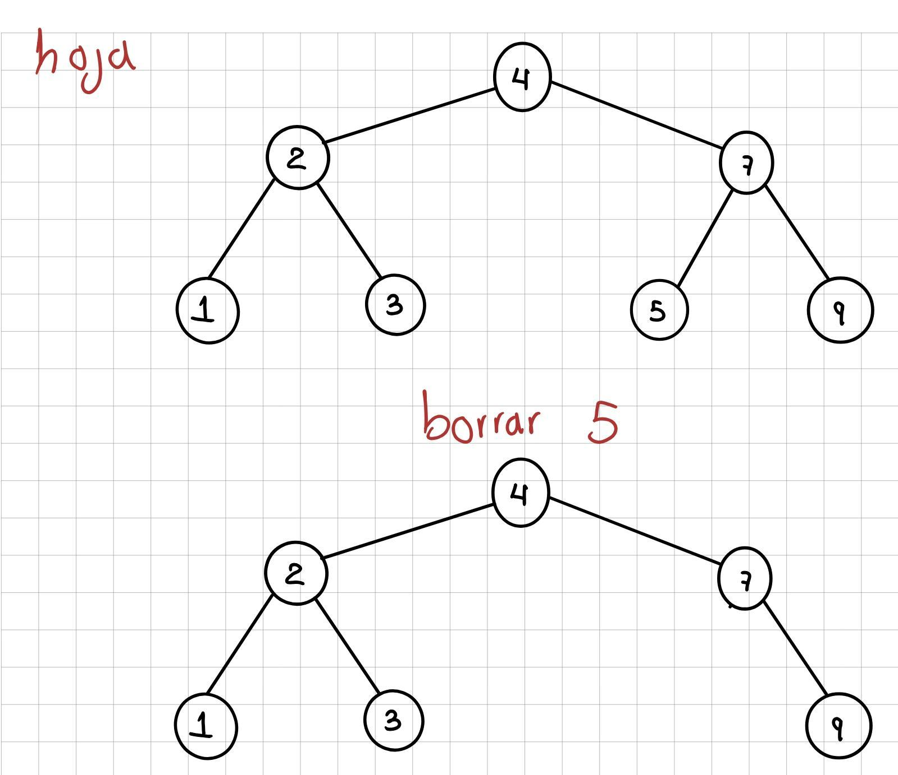

- Nodo padre con un nodo hijo: también es muy sencilla, consiste en que el nodo hijo, independientemente de cuál sea el hijo, izquierdo o derecho, ese hijo se conecta con el padre del nodo que acabamos de borrar, reemplazándolo por decirlo asi.

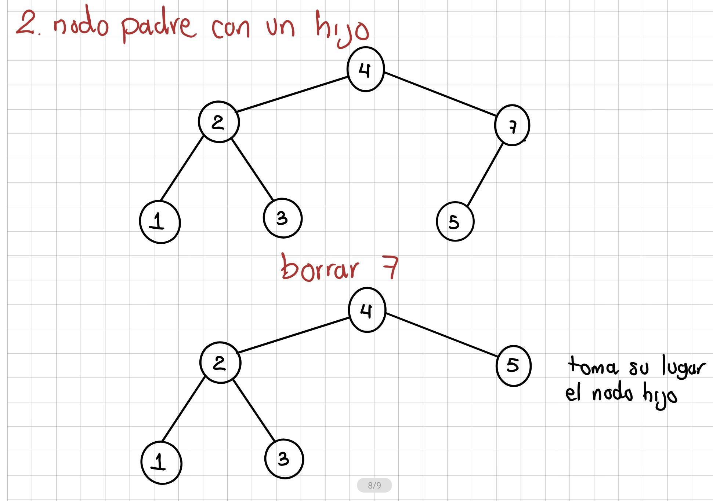

- Nodo padre con dos hijos: en este caso la mejor manera de hacerlo buscar el sucesor inorder, es decir, lo que hacemos es que nos dirigimos a su rama derecha, aquí buscamos el valor menor o más a la izquierda de esta rama, este valor lo reemplazaremos por el elemento que vamos a eliminar, o sea tomará su lugar.

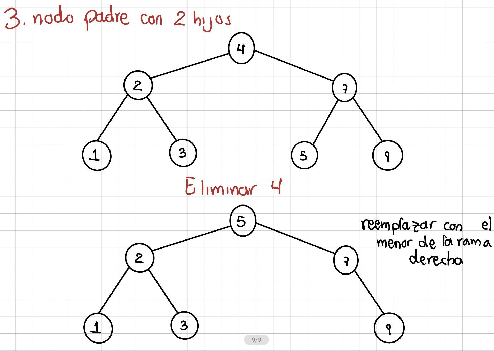

### Implementación

Para este caso, igualmente usaremos una función auxiliar para simplificar su llamada, asi mismo, usaremos otra función para encontrar el minimo de la rama izquierda para el caso del nodo con 2 hijos, está igual no es tan necesaria, pero se hace por practicidad y simplicidad.

```
    def delete(self, value):
        self.root = self._delete(self.root, value)

    def _delete(self, node, value):
        if node is None:
            return None
        if value < node.value:
            node.left = self._delete(node.left, value)
        elif value > node.value:
            node.right = self._delete(node.right, value)
        else:
            if node.left is None and node.right is None:
                return None
            if node.left is None:
                return node.right
            if node.right is None:
                return node.left

            successor = self.find_min(node.right)
            node.value = successor.value
            node.right = self._delete(node.right, successor.value)
        return node

    def find_min(self, node):

        while node.left:
            node = node.left

        return node
```

Aquí la función que nos importa es la auxiliar, está primero revisa si el arbol existe (o sea, no está vacío), posteriormente, lo va recorriendo buscando el valor, una vez que lo encuentra, válida si es no tiene hijos, o sea es una hoja (caso 1), ahi únicamente borra el apuntador o mejor dicho lo vuelve `None`.

En caso tenga un solo hijo (caso 2) retornamos su hijo, ya sea el izquierdo o el derecho, ya que ese hijo lo va a reemplazar.

Y finalmente, si es un nodo con 2 hijos, creamos una variable que busque el minimo de su rama derecha para que ese hijo o sucesor reemplace al nodo borrado, además de borrar a ese sucesor de su posición original.

---

## Operaciones Adicionales

Además de las operaciones adicionales, existen otras operaciones muy importantes a la hora de crear árboles binarios como pueden ser:

### Altura del arbol

Consiste en saber cuál es el camino más largo desde la raíz hasta la hoja más profunda. Para lograr esto de forma sencilla, la función utiliza recursión para ir midiendo la altura de cada subárbol

```
    def height(self):
        return self._height(self.root)

    def _height(self, node):
        if node is None:
            return -1
        return 1 + max(self._height(node.left), self._height(node.right))
```

Si el nodo actual es None (es decir, llegamos al final de una rama o el árbol está vacío), retornamos -1. Esto porque, al sumar el $-1$ de la raíz en el retorno final, la altura de un árbol con un solo nodo sea exactamente $0$.

Por otro lado, Si el nodo existe, calculamos recursivamente la altura de su rama izquierda y de su rama derecha. Usamos la función max() para quedarnos únicamente con el camino más largo + $1$ que es el nivel donde estamos parados al final de la recursión.

### Contar nodos

Esta función nos sirve para saber la cantidad total de elementos o nodos que tiene nuestro árbol actualmente. Para lograr esto de una manera bastante sencilla, recurrimos nuevamente a la recursión para recorrer cada una de las ramas y sumar los nodos que vayamos encontrando a nuestro paso.

```
def count_nodes(self):
        return self._count_nodes(self.root)

    def _count_nodes(self, node):
        if node is None:
            return 0
        return 1 + self._count_nodes(node.left) + self._count_nodes(node.right)
```

Lo que hacemos es sumar $1$ (que representa al nodo actual) más lo que nos devuelva la función al llamarse a sí misma de manera recursiva tanto para la rama izquierda como para la rama derecha, logrando así que al final de la recursión se sumen todos los elementos del árbol.

### Contar hojas

A diferencia de la función anterior, aquí no nos interesa saber el total de nodos, sino únicamente cuántos de ellos son hojas, o sea, aquellos nodos finales que no tienen ningún hijo ni a la izquierda ni a la derecha.

```
def count_leaves(self):
        return self._count_leaves(self.root)

    def _count_leaves(self, node):
        if node is None:
            return 0
        if node.left is None and node.right is None:
            return 1

        return self._count_leaves(node.left) + self._count_leaves(node.right)
```

Primero validamos si el nodo actual es None, en cuyo caso retornamos $0$ porque lógicamente no hay nada que contar allí. Así mismo, verificamos si tanto el apuntador izquierdo como el derecho del nodo actual están vacíos; si esto se cumple, significa que es una hoja, por lo que retornamos $1$.

Finalmente, si el nodo actual resulta ser un nodo padre (es decir, tiene al menos un hijo), no lo contamos y simplemente seguimos bajando de manera recursiva por la rama izquierda y la derecha, sumando únicamente los resultados que devuelvan las hojas que encontremos al final del camino.

### Mínimo y máximo

```
    def min(self):
        current = self.root
        while current.left:
            current = current.left
        return current.value

    def max(self):
        current = self.root
        while current.right:
            current = current.right
        return current.value

```

Para encontrar el mínimo, empezamos parados en la raíz y, mediante un ciclo, nos vamos moviendo siempre hacia el nodo de la izquierda mientras exista uno. Al llegar al final de este camino, sabemos que ese último nodo es el menor de todos, por lo que simplemente retornamos su valor.

Por otro lado, para encontrar el máximo es exactamente el mismo proceso, con la única diferencia de que en el ciclo nos movemos siempre hacia la derecha, que es donde se van guardando los valores más grandes, hasta llegar al nodo del extremo.

### Invertir árbol

Esta función consiste en transformar el árbol de manera que quede como si se reflejara en un espejo. O sea, que todos los nodos que estaban a la izquierda pasen a estar a la derecha y viceversa. Para esto, nos apoyamos de la recursión para ir haciendo este cambio nivel por nivel en todo el árbol.

```
    def invert_tree(self):
        return self._invert_tree(self.root)

    def _invert_tree(self, node):
        if node is None:
            return

        node.left, node.right = node.right, node.left

        self._invert_tree(node.left)
        self._invert_tree(node.right)
```
Para lograrlo, primero evaluamos si el nodo actual es None, en cuyo caso no hacemos nada y simplemente regresamos, ya que llegamos al final de una rama.

Sin embargo, si el nodo sí existe, lo primero que hacemos es intercambiar de posición sus dos hijos directamente (el izquierdo pasa a la derecha y el derecho a la izquierda). Una vez hecho este cambio en el nodo actual, volvemos a llamar a la función de manera recursiva para que repita exactamente este mismo proceso con sus hijos, logrando así voltear el árbol completo de arriba hacia abajo.


---

## Árbol AVL

Un arbol AVL es básicamente un arbol binario normal, pero con la diferencia que este se mantiene balanceado, aquí balanceado es donde las alturas de los subárboles izquierdo y derecho de cualquier nodo difieren como máximo en una unidad. Es decir:

$$
Balance = altura(izquierdo) − altura(derecho)
$$

Por ejemplo, esto en un arbol binario normal sería perfectamente permitido:

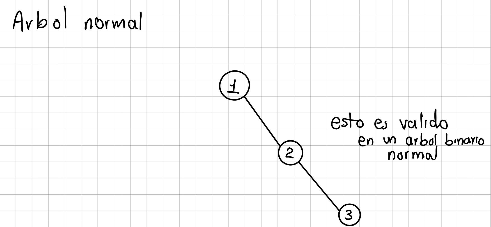

Sin embargo, para un arbol binario AVL la manera correcta sería:

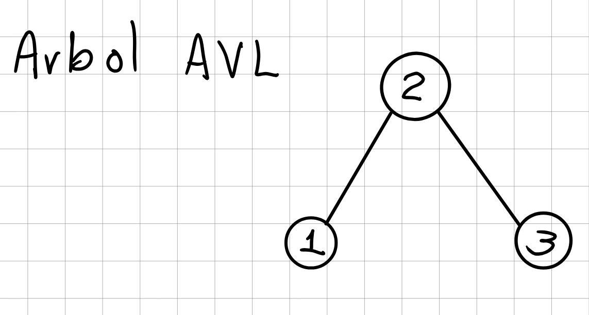

Este puede cambiar la raiz de ser necesario para que esté balanceado, este tipo de arbol tiene ventajas como:

- Al estar siempre balanciado, todas sus operaciones seran $O(log(n))$, ya que siempre estara distribuido a mitades por decirlo asi, a diferencia de un arbol normal, que en el peor de los casos, sus operaciones seran de complejidad $O(n)$, ya que puede recorrer todos los elementos a la hora de buscar, insertar o eliminar elementos.

###  Como se balancea

Primero debemos saber que para considerar que el arbol está desbalanceado cuando: 

$$
Balance = altura(izquierdo) − altura(derecho) < 2
$$

Es decir, que la diferencia de alturas de una rama a la otra debe ser maximo un nivel más alto que la otra, por lo que si una rama es 2 niveles más largos que otra, debemos balancear el arbol, para esto existen 4 casos:

- **Left-Left(LL)**: significa que el arbol está muy cargado hacia la izquierda y que la última hoja esta hacia la izquierda también, la mejor solución es que el nodo del medio, se vuelva la raiz, y desplazamos la raiz original a la rama derecha.

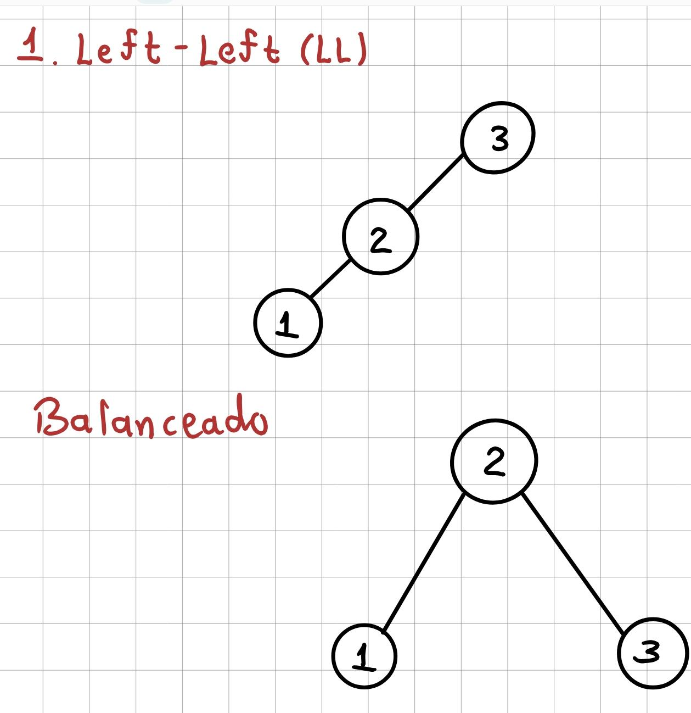

- **Right-Right(RR)**: Es lo mismo que el caso anterior, con la diferencia de que ahora se encuentra recargado a la derecha con la última hoja también hacia la derecha, por lo que toca que el nodo del medio se vuelva la raiz y la raiz original mandarla a la rama izquierda.

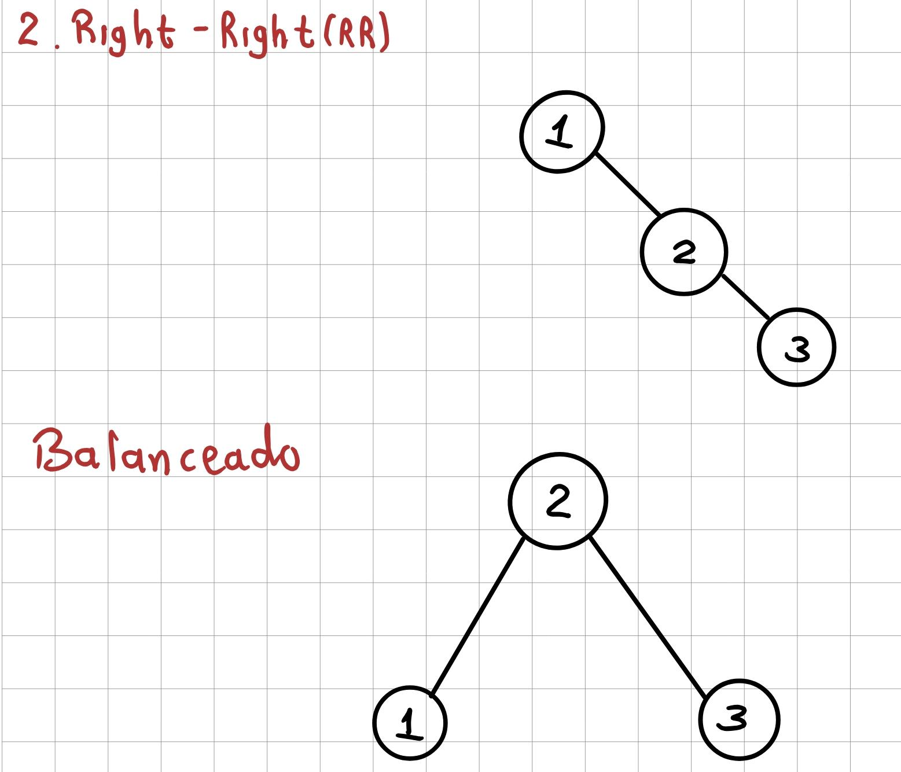

- **Left-Right**: Este caso es distinto, este quiere decir que el arbol está muy cargado hacia la izquierda, pero que la hoja esta hacia la derecha, en este caso toca hacer 2 rotaciones, la primera es volver el arbol una **LL** y ahi si, balancearla bien como se hizo antes.

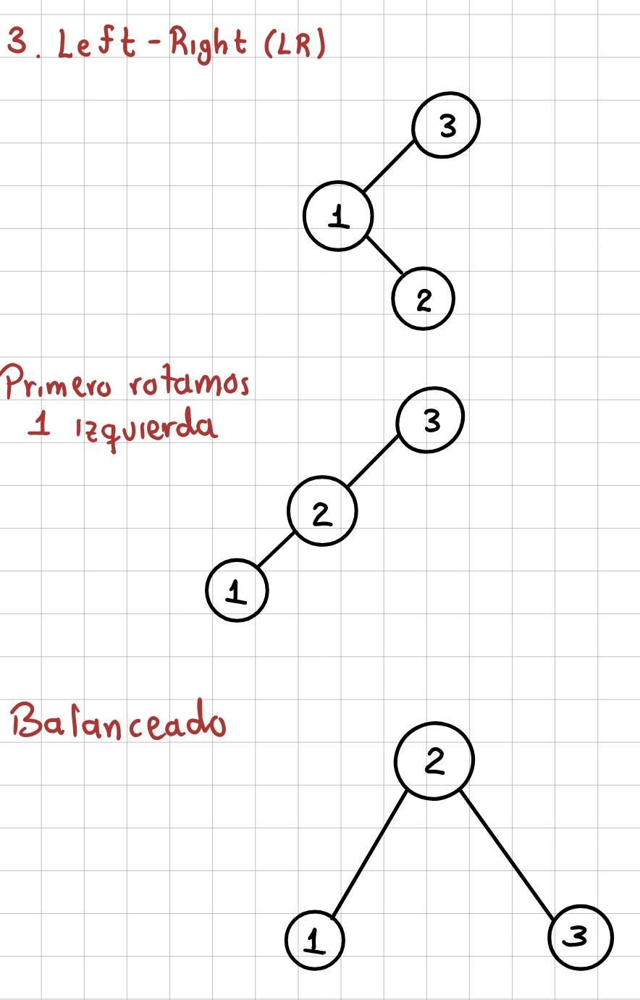

- **Right-Left**: Este es el opuesto al anterior, ahora el arbol está recargado hacia la derecha, pero su última hoja esta hacia la izquierda. Por lo que, para balancearlo, primero lo tenemos que volver un **RR** y ya ahi lo balanceamos.

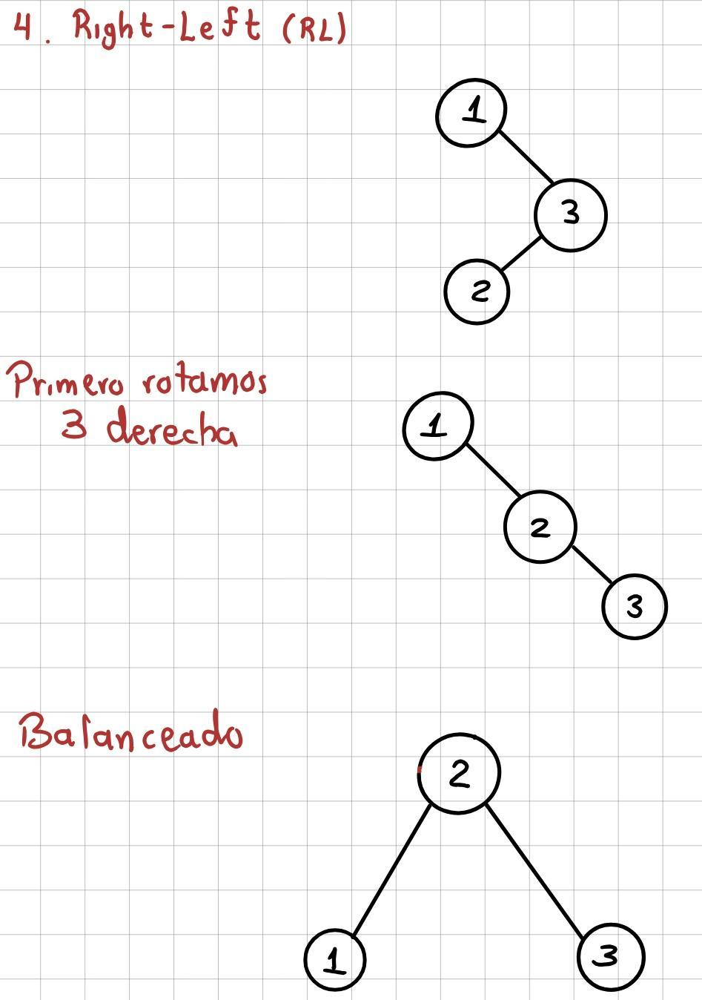

### Implementación

Antes que todo, para este caso toca realizar diferencias y modificaciones, primero crearemos unas nuevas funciones y atributos para velocidad:

```
class Node:
    def __init__(self, value):
        self.value = value
        self.left = None
        self.right = None
        self.height = 1
```
En la clase `Node` creamos un nuevo atributo para la altura, de esta manera no tenemos que recorrer el arbol cada vez que la necesitemos y se actualiza cada que hagamos cambios insertando o eliminando elementos. Ahora sí pasamos a las funciones nuevas.

Para que un árbol AVL pueda mantenerse balanceado de forma automática, primero necesitamos añadir algunas funciones de apoyo que nos permitan conocer qué tan inclinadas están nuestras ramas. Al igual que en un árbol binario normal, las funciones principales se mantienen igual, pero ahora usaremos estos nuevos métodos para calcular alturas y el factor de equilibrio de cada nodo.

#### Obtener Altura

A diferencia del árbol binario tradicional donde calculábamos la altura recorriendo todo el árbol con recursión, en un árbol AVL cada nodo guarda su propia altura en una variable. Por ende, para consultar este dato de forma rápida y sin tantas vueltas, simplemente accedemos directamente a este atributo.

```
 def get_height(self):
        return self._get_height(self.root)

    def _get_height(self, node):
        if node is None:
            return 0
        return node.height
```

Primero revisa si el nodo actual está vacío o es None, por lo que de ser así retornamos $0$ porque un nodo inexistente no tiene altura. Por otro lado, si el nodo sí existe, simplemente devolvemos el valor que tiene guardado en su variable height, ahorrándonos tener que recorrer la rama completa cada vez que necesitemos este dato.

#### Obtener balance
Esta es importante para el árbol AVL, ya que nos ayuda a saber si una rama está más pesada que la otra. El factor de balance se calcula restando la altura del hijo izquierdo menos la altura del hijo derecho.
```
    def get_balance(self):
        return self._get_balance(self.root)

    def _get_balance(self, node):
        if node is None:
            return 0

        return self._get_height(node.left) - self._get_height(node.right)
```

Para hacer este cálculo, primero validamos si el nodo es None, en cuyo caso retornamos $0$, ya que un nodo vacío está perfectamente equilibrado. Sin embargo, si el nodo existe, lo que hacemos es llamar a nuestra función anterior para traer la altura de su rama izquierda y restarle la altura de su rama derecha.

Este resultado nos dirá qué tan desbalanceado está el nodo: si nos da un número positivo (como $1$ o mayores), significa que la rama izquierda es más alta, mientras que si nos da un número negativo (como $-1$ o menores), la rama derecha es la que está más pesada.

Cuando el factor de balance nos indica que el árbol está desbalanceado, es decir, que una rama pesa más que la otra, debemos realizar "rotaciones" para volver a equilibrarlo. Estas rotaciones lo que hacen es reorganizar los apuntadores de los nodos involucrados sin perder el orden de los elementos, logrando así que la estructura vuelva a estar en perfecta armonía.

#### Rotación a la derecha

Esta rotación se aplica cuando el desbalance ocurre en la rama izquierda (el subárbol izquierdo está más pesado). Lo que hacemos básicamente es "bajar" el nodo desbalanceado hacia la derecha y subir a su hijo izquierdo para que tome su lugar.

```
        def rotate_right(self, y):
        x = y.left
        T2 = x.right

        x.right = y
        y.left = T2

        y.height = 1 + max(self.get_height(y.left), self.get_height(y.right))

        x.height = 1 + max(self.get_height(x.left), self.get_height(x.right))
        return x
```

Para realizar este movimiento, primero definimos unas variables de apoyo; asignamos a `x` como el hijo izquierdo del nodo desbalanceado `y`, y a `T2` como el hijo derecho de esa `x`. Hecho esto, viene el intercambio de los apuntadores: hacemos que `y` pase a ser el hijo derecho de `x`, y para no perder la rama `T2` que quedó suelta, la conectamos en el espacio que quedó vacío a la izquierda de `y`.

Finalmente, como la estructura cambió y los nodos ahora están en posiciones diferentes, recalculamos de forma manual las nuevas alturas primero para `y` y luego para `x` usando nuestra función auxiliar, retornando finalmente al nodo `x` que ahora es la nueva raíz de este subárbol.

#### Rotación a la izquierda

Es exactamente el mismo principio que la rotación anterior, pero de forma invertida. Se utiliza cuando el desbalance está cargado hacia el lado derecho, por lo que necesitamos "bajar" el nodo desbalanceado hacia la izquierda y subir a su hijo derecho.

```
    def rotate_left(self, x):
        y = x.right
        T2 = y.left

        y.left = x
        x.right = T2

        x.height = 1 + max(self.get_height(x.left), self.get_height(x.right))

        y.height = 1 + max(self.get_height(y.left), self.get_height(y.right))
        return y
```

En este caso, guardamos en `y` al hijo derecho de `x`, y en `T2` al hijo izquierdo de esa `y`. Después realizamos el intercambio haciendo que `x` pase a ser el hijo izquierdo de `y`, mientras que la rama `T2` la reubicamos conectándola a la derecha de x.

Por último, cerramos recalculando las alturas de ambos nodos para que queden con sus datos actualizados y retornamos al nodo `y` como la nueva raíz de esta sección.

#### Modificar Insert y delete

Antes de crear dichas funciones, necesitamos de una función auxiliar para no tener que realizar ese cálculo dentro de las funciones de insertar las funciones de insertar y eliminar.

**Rebalancear**

Para evitar repetir el mismo bloque de código tanto en la inserción como en la eliminación, agrupamos toda la lógica de cálculo de alturas y rotaciones en una sola función auxiliar de rebalanceo. Esto nos permite mantener el código ordenado, modular y mucho más fácil de leer.
```
    def rebalance(self, node):
        node.height = 1 + max(self._get_height(node.left), self._get_height(node.right))
        balance = self._get_balance(node)

        if balance > 1:
            if self._get_balance(node.left) < 0:
                node.left = self.rotate_left(node.left)
            return self.rotate_right(node)

        if balance < -1:
            if self._get_balance(node.right) > 0:
                node.right = self.rotate_right(node.right)
            return self.rotate_left(node)

        return node
```

Lo que hace esta función es encargarse de todo el trabajo sucio del árbol AVL. Primero, actualiza la altura del nodo actual tomando el camino más largo de sus hijos y calcula su factor de balance para medir la inclinación. 

A partir de ahí, evalúa si es necesario aplicar rotaciones usando estas condiciones:

* **Desbalance a la izquierda (balance > 1):** Significa que el subárbol izquierdo está muy pesado. Antes de rotar, verificamos si su hijo izquierdo tiene balance negativo (menor a 0); si es así, tenemos un caso de "zigzag", por lo que primero rotamos a la izquierda ese hijo. Finalmente, aplicamos la rotación a la derecha en el nodo actual para equilibrarlo.
* **Desbalance a la derecha (balance < -1):** Aquí el peso está en el subárbol derecho. De igual manera, revisamos si su hijo derecho tiene balance positivo (mayor a 0) para detectar el "zigzag" opuesto; de cumplirse, rotamos primero a la derecha ese hijo. Al terminar, hacemos la rotación a la izquierda sobre el nodo actual para devolver el equilibrio.

Si el factor de balance está dentro de los límites permitidos (entre -1 y 1), la función simplemente ignora las condiciones y retorna el nodo tal cual, ya que no necesita ningún cambio.

**Modificación de insertar y eliminar**

Con esta función, las funciones de insertar y eliminar, quedan casi exactamente igual a como eran en un arbol binario normal con una diferencia:

```
    def _insert(self, node, value):
        if node is None:
            return Node(value)

        if value < node.value:
            node.left = self._insert(node.left, value)

        elif value > node.value:
            node.right = self._insert(node.right, value)

        else:
            return node

        return self.rebalance(node)
```

```
    def _delete(self, node, value):
        if node is None:
            return None
        if value < node.value:
            node.left = self._delete(node.left, value)
        elif value > node.value:
            node.right = self._delete(node.right, value)
        else:
            if node.left is None and node.right is None:
                return None

            if node.left is None:
                return node.right

            if node.right is None:
                return node.left

            successor = self.find_min(node.right)
            node.value = successor.value
            node.right = self._delete(node.right, successor.value)

        if node is None:
            return node

        return self.rebalance(node)
```

Como se puede observar en ambos códigos, la única diferencia respecto a las funciones originales del árbol binario es la última línea, donde en lugar de retornar el nodo directamente con un `return node`, ahora hacemos un `return self.rebalance(node)` para verificar el balanceo y balancear de ser necesario. 

---

## Material adicional:

[](https://www.youtube.com/watch?v=tBaOQeyXYqg&t=492s)

[](https://www.youtube.com/watch?v=Jo2euX89Oz8)

[](https://www.youtube.com/watch?v=KY_6Xduq8jc)

[](https://www.youtube.com/watch?v=xLfflCQDPio)
