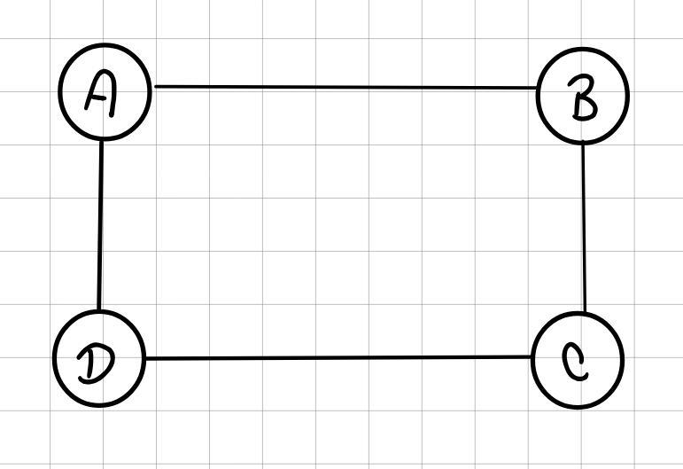
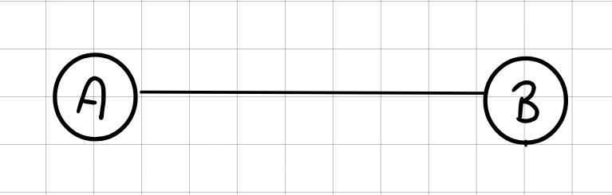
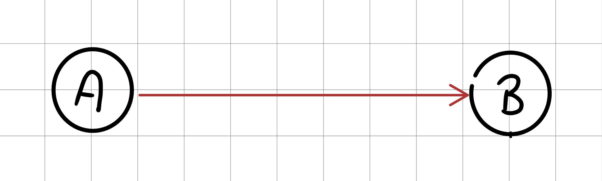
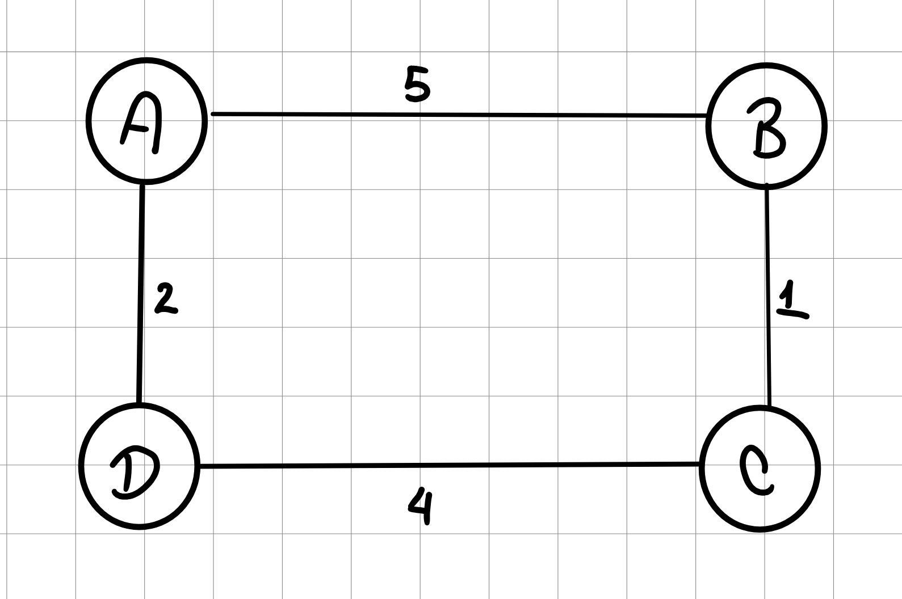
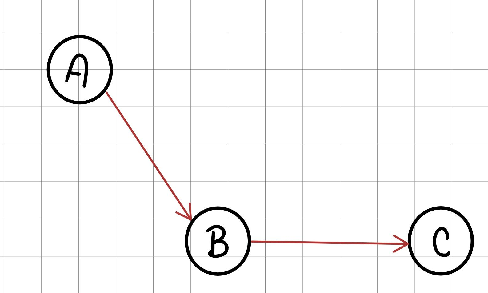
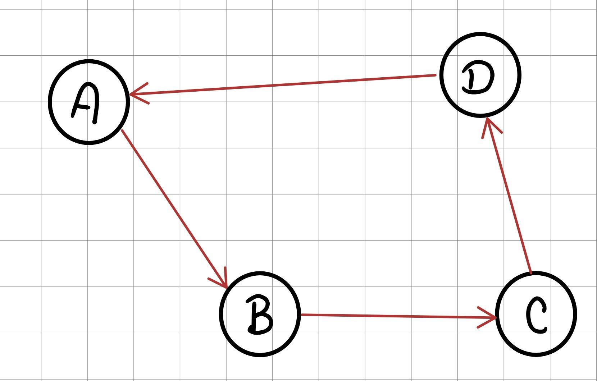
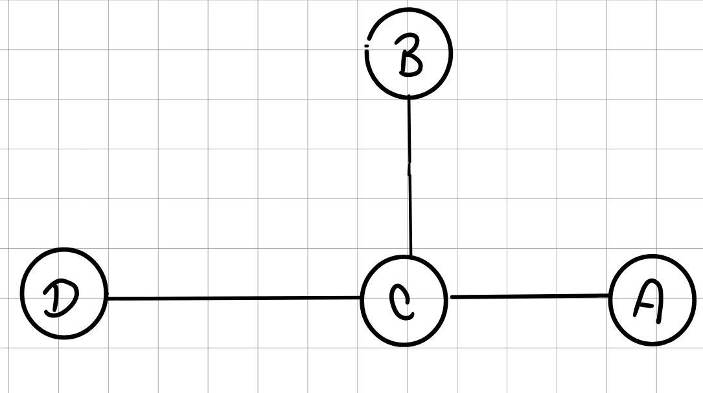

# Grafos

---

Un grafo es uan estructura de datos No lineal, esta está conformada por Vertices (nodos) que representan los objetos o elementos, y aristas que representan la conexión entre los objetos.



Por ejemplo aca:
* vertices = A, B, C, D
* Aristas = (A,B), (A,D), (B,C), (C,D)

Los grafos generalmente se usan para modelar relaciones entre varios objetos que no necesariamente todos deben estar relacionados con todos.

---

## Tipos de grafos

* **Grafo no dirigido**: significa que la conexión entre ambos nodos es bidireccional, o sea funciona en ambos sentidos.



Aca A apunta a B y B apunta hacia A.

* **Grafo dirigido**: este es el opuesto, aquí la conexión entre objetos solo va hacia una dirección.



Aca A apunta a B pero B no apunta a A.

* **Grafo ponderado**: En este caso las aristas o conexiones tienen valores o costos.



Este valor puede representar cosas como la distancia, tiempo, dinero o energía dependiendo el caso y que sea lo que se pidió.

* **Grafo no ponderado**: Aquí todas las conexiones tienen el mismo valor por lo que se omite eso.


---

## Términos importantes

* **Adyacente**: Son dos nodos conectados directamente


A es adyacente a B.

* **Camino**: Secuecia de nodos conectados.



`A -> B -> C`

* **Ciclo**: secuencia de nodo que permite volver al nodo inicial



`A -> B -> C -> D -> A`

* **Grado de un nodo**: Es la cantidad de conexiones de un nodo.



C tiene grado 3

---

## Representaciones

Los grafos tienen distintas formas de representarse aparte de la forma convencional que es la de las imágenes, aparte de esa están:

### Matriz de adyacencia:

Es una matriz de $n * n$ (donde $n$ es el número de vertices u objetos), donde cada fila y columna representan un nodo, el valor de la celda $(i, j)$, indica si existe una arista desde el nodo $i$ al nodo $j$.

Por ejemplo si tenemos:


Su matriz de adyacencia seria asi:

|           | A | B | C | D |
|:----------|:-:|:-:|:-:|:-:|
| **A**     | 0 | 1 | 0 | 1 |
| **B**     | 1 | 0 | 1 | 0 |
| **C**     | 0 | 1 | 0 | 1 |
| **D**     | 1 | 0 | 1 | 0 |

Es como una matriz binaria, los $0$ representan que esos dos nodos no tienen conexión entre sí, y $1$ representa que si existe una conexión. 

Ahora bien, este caso es con un grafo bidireccional por lo que, en caso se tenga un grafo dirigido como:


la matriz seria:

|           | A  | B | C | D  |
|:----------|:--:|:-:|:-:|:--:|
| **A**     | 0  | 1 | 0 | 0  |
| **B**     | 0  | 0 | 1 | 0  |
| **C**     | 0  | 0 | 0 | 1  |
| **D**     | 1  | 0 | 0 | 0  |

Aquí las filas dicen quien apunta a quien, por ejemplo, A apunta a B, por lo que en la fila de A se pone el valor, y asi con todos.

### Lista de adyacencia

Esta es muy parecida, sin embargo, esta es más utilizada en forma de código o no tanto de forma matematica.

Usando los mismos 2 ejemplos, la lista de adyacencia del primer grafo sería:
```
A -> B, D
B -> A, C
C -> B, D
D -> A, C
```

O en forma de código seria como un diccionario:
```
graph = {
    "A": ["B", "D"],
    "B": ["A", "C"],
    "C": ["B", "D"],
    "D": ["A", "C"]
}
```

O para el caso de un grafo dirigido como el ejemplo anterior, la lista quedaría:

```
A -> B
B -> C
C -> D
D -> A
```
O como código:

```
graph = {
    "A": ["B"],
    "B": ["C"],
    "C": ["D"],
    "D": ["A"]
}
```

---

## Cambios en las complejidades

Los grafos al no ser una estructura lineal, asi como sus recorridos no son lineales o de mitades como los árboles binarios, estos funcionan con complejidades distintas, por lo que ahora en vez de ser representadas con $n$, estos se representan con nuevos símbolos los cuales serán $V$ que representa la cantidad de vertices (nodos) y $E$ que representa la cantidad de aristas (Edges).

Esto ya que los grafos pueden tener una cantidad distinta de vertices y de aristas, a diferencia de las demás estructuras que lo unico importante era la cantidad de elementos, aquí son 2 factores para calcular la complejidad.

Por otro lado, la complejidad depende de qué forma se hace, ya que es distinto si se hace como una **lista de adyacencia** o como una **matriz de adyacencia**.

### Lista de adyacencia

```
graph = {
    "A": ["B", "C"],
    "B": ["C"],
    "C": ["D"],
    "D": []
}
```

#### Agregar un vertice o nodo

`graph["E"] = []`, al agregar un nuevo elemento a un diccionario, tiene una complejidad de $O(1)$.

#### Agregar una arista

`graph["A"].append("D")`, append en diccionarios es una operación $O(1)$.

#### Obtener los vecinos de un nodo

Por ejemplo para `"A"`, a pesar de ser 2 elementos, no necesitamos recorrer la lista, solo retornarla, por lo que esta operación también es $O(1)$.

#### Verificar si existe una arista

En este caso, debemos recorrer la lista, por lo que su complejidad será de $O(grado(A))$ donde $grado(A)$ es la cantidad de vecinos de A.

#### Eliminar una arista

Para eliminarla, primero debemos encontrarla, por lo que toca recorrer la lista, esto hace que su complejidad sea $O(grado(A))$.

#### Eliminar un vertice

Aquí cambia el costo, ya que toca eliminar tanto el nodo en sí como sus aristas con sus vecinos, tanto de su lista, como de la lista de los vecinos de este en caso de que este.

Por lo que su complejidad cambia a $O(V + E)$

#### Recorridos como BFS o DFS

Estos algoritmos visitan cada nodo o su mayoría generalmente, asi mismo, revisan cada arista una vez, por lo que su complejidad es de $O(V + E)$.


### Matriz de adyacencia

```
matrix = [
    [0,1,1,0],  #A
    [0,0,1,0],  #B
    [0,0,0,1],  #C
    [0,0,0,0]   #D
]
```

#### Agregar un vertice o nodo

Aquí, como tenemos que extender la matriz con una fila y columna nueva, debemos crear una matriz más grande, asi como recorrerla en todos los niveles para agregar la nueva columna y todas las filas, porque su complejidad se dispara a $O(V²)$. 

#### Agregar una arista 

En este caso, como el tamaño de la matriz ya está definido por la cantidad de vertices, agregar una arista sería únicamente cambiar un valor de $0$ a $1$, tipo `matrix["A"]["D"] = 1`, por lo que su complejidad es de $O(1)$.

#### Obtener los vecinos de un nodo

Aquí tenemos que posicionarnos en la fila que representa ese nodo y recorrerla para saber sus vecinos, lo que vuelve su complejidad $O(V)$.

#### Verificar si existe una arista

Al ser una matriz, que en sí sería una cantidad de listas dentro de otra lista, estas cuentan con índices y valores, por lo que consultar una posicion como ya sabemos es de $O(1)$.

#### Eliminar una arista

Lo mismo que agregar una arista, pero al revés, es decir, solo es cambiar el valor de $1$ a $0$, o sea, complejidad de $O(1)$.

#### Eliminar un vertice

Este es muy complejo, ya que debemos borrar una columna y una fila y reorganizar la matriz de ser necesario, por lo que como toca hacer recorridos en todas las filas y columnas, su complejidad se eleva a $O(V²)$.

#### Recorridos como BFS o DFS

En este caso, los recorridos son más complejos, ya que, para buscar a sus vecinos, debe revisar toda la fila, y esto ocurre con todos los vertices, por lo que la complejidad se eleva a $O(V²)$.

---

## Implementación

### Grafo no dirigido

La mejor manera de implementar un grafo no dirigido es utilizando clases nuevamente, de igual forma, para su creación o mejor dicho, su estructura para guardar los nodos y aristas, ahi muchas maneras, sin embargo, usaremos la más conocida, que es usando un diccionario.

```
class Graph:
    def __init__(self):
        self.adjacency_list = {}
```

Aquí el diccionario funcionará de la siguiente manera: Cada llave representa al nodo o vertice del grafo; mientras que cada valor será una lista con los vecinos de ese nodo. Asi como, se tiene en los ejemplos de lista de adyacencia. 

Asi mismo, para tener lo esencial de un grafo, necesitamos crear una función para agregar los nodos y otra para conectar esos nodos, o mejor dicho, crear las aristas.

```
    def add_vertex(self, v):
        if v not in self.adjacency_list:
            self.adjacency_list[v] = []
```
Aquí únicamente verificamos si el nodo que estamos creando existe en el diccionario, en caso de que no, lo creamos y su valor lo dejamos como una lista vacía, ya que no sabemos qué vecinos tiene.

```
    def add_edge(self, v1, v2):
        self.add_vertex(v1)
        self.add_vertex(v2)
        self.adjacency_list[v1].append(v2)
        self.adjacency_list[v2].append(v1)
```

Ahora, para crear las aristas entre los nodos, primero verificamos que ambos nodos existan, en caso de que no, simplemente los creamos, ahora para cada nodo, los agregamos mutuamente en su lista de vecinos (este grafo es no dirigido, en caso de ser dirigido, la función cambia, pero eso lo abordaremos más adelante).

Por lo que, en caso de crear o instanciar el grafo para probarlo podemos hacer algo como:

```
g = Graph()
g.add_edge("A", "B")
g.add_edge("B", "C")
print(g.adjacency_list)
```

Aquí instanciamos el grafo y añadimos sus nodos con sus respectivas conexiones o aristas, por lo que no es necesario usar la función `add_vertex` a menos que se quiera crear un nodo sin vecinos.

Esto es lo más esencial a la hora de tener un grafo, es decir, lo minimo para tener un grafo. Sin embargo, este se puede complementar con otras funciones muy utiles como:

#### revisar si un nodo existe
```
    def has_vertex(self, v):
        return v in self.adjacency_list
```

#### Obtener los vecinos de un nodo

```
    def get_neighbors(self, v):
        if not self.has_vertex(v):
            return False
        return self.adjacency_list[v]
```

#### Revisar si existe una arista o una conexión entre dos nodos

```
    def has_edge(self, v1, v2):
        if not self.has_vertex(v1) or not self.has_vertex(v2):
            return False
        return v2 in self.adjacency_list[v1]
```

#### Quitar una conexión

```
    def remove_edge(self, v1, v2):
        if v1 in self.adjacency_list and v2 in self.adjacency_list[v1]:
            self.adjacency_list[v1].remove(v2)
        if v2 in self.adjacency_list and v1 in self.adjacency_list[v2]:
            self.adjacency_list[v2].remove(v1)
```

Aquí hacemos una doble verificación, ya que el nodo es no dirigido, por lo que toca borrar esa conexión en ambos nodos.

#### Quitar un nodo

```
    def remove_vertex(self, v):
        if v in self.adjacency_list:
            for neighbor in self.adjacency_list[v]:
                self.adjacency_list[neighbor].remove(v)
            self.adjacency_list.pop(v)
```

Aquí tenemos que borrar el nodo tanto de la lista de vecinos como del diccionario, ya que si se queda en alguno, a la hora de recorrer el grafo usando algoritmos como BFS o DFS se romperian al visitar un nodo "fantasma".

#### Contar la cantidad de nodos y aristas

```
    def vertex_count(self):
        return len(self.adjacency_list)

    def edge_count(self):
        total = sum(len(neighbors) for neighbors in self.adjacency_list.values())
        return total // 2  

```

Y la cuenta de aristas o conexiones, se divide en 2, ya que al ser no dirigido, este tiene las conexiones repetidas.

#### Mostrar los elementos

Ahora para grafos, la búsqueda y como mostrar los elementos es diferente, ya que se usa algo llamado **algoritmos de búsqueda**, los cuales son un tema muy grande que además tienen su propio repositorio, para este caso, se usara **DFS** (Depth-First Search / Búsqueda en profundidad) para este grafo.

Este en términos simples lo que hace es va explorando por capas, es decir, va lo más profundo posible por un camino hasta encontrar la meta o hasta quedarse sin poder seguir avanzando por ese camino. En ese caso retrocede hasta la última vez que hubo una bifurcación y continua asi hasta encontrar la meta. 

Como se dijo anteriormente, se explicara más a fondo este y los demás en su repositorio sobre **algoritmos de búsqueda**, por lo que el caso de buscar elementos lo dejaremos para después, únicamente haremos como mostrar todos los nodos de un grafo.

```
    def dfs(self, start):
        visited = set()
        stack = [start]
        result = []
        while stack:
            vertex = stack.pop()
            if vertex not in visited:
                visited.add(vertex)
                result.append(vertex)
                for neighbor in self.get_neighbors(vertex):
                    if neighbor not in visited:
                        stack.append(neighbor)
        return result
```

Para este caso utilizaremos una pila para guardar los nodos en los que vamos avanzando, para en caso de no ser el camino, devolvernos al último, por eso la pila.

Entonces, realizamos lo siguiente, creamos la pila con el elemento con el que vamos a empezar dentro de ella y mientras la pila no este vacía, sacamos el último elemento de la pila y verificamos que no esté en los visitados (ya que puede haber un mismo nodo en la pila varias veces), ahora si el nodo no había sido visitado, lo agregamos a los visitados y al resultado, además de agregar sus vecinos a la pila. 

---

### Grafo dirigido

En este caso, es muy parecido al código que ya teníamos, pero al ser dirigido, debemos de hacer una serie de cambios en algunos metodos, por el momento su "constructor" es igual.

```
class Graph:
    def __init__(self):
        self.adjacency_list = {}
```

Asi mismo, la función `add_vertex` no cambia nada.

```
    def add_vertex(self, v):
        if v not in self.adjacency_list:
            self.adjacency_list[v] = []
```

Ahora, para la función `add_edge` si tiene un cambio pequeño:

```
    def add_edge(self, v1, v2):
        self.add_vertex(v1)
        self.add_vertex(v2)
        self.adjacency_list[v1].append(v2)
```

En este caso, únicamente eliminamos la última línea donde `v2` ahora no guarda a `v1`, es decir que la logica es, `v1` apunta a `v2`.

Ahora para las demás funciones, las funciones `has_vertex`, `get_neighbors`, `vertex_count`, `has_edge` y el algoritmo de búsqueda elegido (en este caso `dfs`) tampoco cambian.

> [!NOTE]
> **Nota:** Aunque la función `has_edge` no cambia, si cambia su comportamiento
>```
>    def has_edge(self, v1, v2):
>        if not self.has_vertex(v1) or not self.has_vertex(v2):
>            return False
>        return v2 in self.adjacency_list[v1]
>```
> Ya que ahora sí hacemos algo como:
> 
> ```
> g = Directed_graph()
> g.add_edge("A", "B")
> print(g.has_edge("A", "B"))
> #print(g.has_edge("B", "A"))
> ```
> Con el grafo no dirigido ambas nos darán `True` mientras que con el no dirigido, al tener `A apunta a B`, la primera nos dara `True`, mientras la segunda nos dara `False`. 


Ahora para las demás funciones si hubo cambios:

#### Quitar una conexión

```
    def remove_edge(self, v1, v2):
        if v1 in self.adjacency_list and v2 in self.adjacency_list[v1]:
            self.adjacency_list[v1].remove(v2)
```

Al ser dirigido, o sea en una sola dirección, no necesitamos la doble verificacion, solo la del nodo que apunta.

#### Quitar un nodo

```
    def remove_vertex(self, v):
        if v in self.adjacency_list:
            self.adjacency_list.pop(v)
            for vertex in self.adjacency_list:
                if v in self.adjacency_list[vertex]:
                    self.adjacency_list[vertex].remove(v)
```

En este caso, ya que antes recorríamos la lista de sus vecinos para eliminar ese nodo y luego eliminar esa clave, pero ahora puede que algunos de sus vecinos puede que no estén en su lista, por lo que toca cambiar su funcionamiento.

Por lo que ahora toca recorrer todo el diccionario, no solo los vecinos de ese nodo.

---

### Grafo no dirigido ponderado

Ahora para un grafo ponderado, debemos agregar un nuevo atributo para saber el peso de las aristas, por lo que ahora la lista que usábamos para definir los vecinos, se deba cambiar un poco, ya que los elementos ahora deben ser tuplas.

Por ejemplo, si antes teníamos algo como `{"A": ["B","C"]}`, ahora que cada vecino tiene su respectivo peso esta cambia a: `{"A":[("B", 4), ("C", 5)]}`, Por lo que su mayor cambio cae a la hora de insertar valores a la lista de vecinos de un vertice.

Por lo que el constructor de la clase no cambia asi como `add_vertex`, `get_neighbors`  y `remove_vertex` no cambian, sin embargo, todo lo que tiene que ver con las aristas se tiene que adaptar al nuevo formato.

#### Agregar una arista

```
    def add_edge(self, v1, v2, weight):
        self.add_vertex(v1)
        self.add_vertex(v2)
        self.adjacency_list[v1].append((v2, weight))
        self.adjacency_list[v2].append((v1, weight))
```

Ahora también se recibe el peso de la arista, asi como al agregar a la lista de vecinos, se ingresan en forma de tupla para guardar tanto el nombre del vertice como su peso.

#### Revisar si existe una arista o una conexión entre dos nodos

```
    def has_edge(self, v1, v2):
        for neighborn, weight in self.adjacency_list.get(v1, []):
            if neighborn == v2:
                return True
        return False
```

Este cambia, ya que al ser una tupla, la función `remove()` no funciona, por lo que debemos recorrer la lista y si encontramos el elemento que buscamos frenamos y retornamos `True`, y si no lo encontramos retornamos `False`.

#### Eliminar una arista

```
    def remove_edge(self, v1, v2):
        if v1 in self.adjacency_list:
            new_list = []
            for n, w in self.adjacency_list[v1]:
                if n != v2:
                    new_list.append((n, w))
            self.adjacency_list[v1] = new_list
        if v2 in self.adjacency_list:
            new_list = []
            for n, w in self.adjacency_list[v2]:
                if n != v1:
                    new_list.append((n, w))
            self.adjacency_list[v2] = new_list
```

Para eliminar una arista, al ser una tupla, la mejor manera de hacerlo es volviendo a crear la lista, pero sin el elemento que queremos eliminar, esto tenemos que hacerlo en ambas listas de los 2 vertices.

#### Obtener el peso de una arista

```
    def get_weight(self, v1, v2):
        for neighbor, weight in self.adjacency_list.get(v1, []):
            if neighbor == v2:
                return weight
        return None
```

#### Recorrer el grafo con dfs

```
    def dfs(self, start):
        visited = set()
        stack = [start]
        result = []
        while stack:
            vertex = stack.pop()
            if vertex not in visited:
                visited.add(vertex)
                result.append(vertex)
                for neighbor, weight in self.get_neighbors(vertex):
                    if neighbor not in visited:
                        stack.append(neighbor)
        return result
```

Este prácticamente no cambia nada, ya que el unico cambio es en el ciclo `for`, ya que "desenglosamos" la tupla para tener el nombre del nodo vecino.

---

### Grafo dirigido ponderado

Este es una combinación de ambos, y es el que generalmente para aplicaciones para mapas por ejemplo, al ser una combinación de ambos temas, sus funciones son casi las mismas que la de un grafo dirigido pero agregando el peso.

Por lo que algunos metodos no cambian, como el constructor, `add_vertex`, `has_vertex`, `get_neigborns`, `has_edge`, `vertex_count`, `dfs` y `get_weight`.

Asi como, los metodos restantes se adaptan a los metodos de grafo dirigido pero con los pesos:

#### Añadir una arista

```
    def add_edge(self, v1, v2, weight):
        self.add_vertex(v1)
        self.add_vertex(v2)
        self.adjacency_list[v1].append((v2, weight))
```

#### Eliminar una arista

```
    def remove_vertex(self, v):
        if v in self.adjacency_list:
            self.adjacency_list.pop(v)
            for vertex in self.adjacency_list:
                new_list = []
                for n, w in self.adjacency_list[vertex]:
                    if n != v:
                        new_list.append((n, w))
                self.adjacency_list[vertex] = new_list
```

Misma logica que el anterior de crear una nueva lista sin la arista a borrar, pero solo con una verificación en vez de dos.

```
    def remove_vertex(self, v):
        if v in self.adjacency_list:
            self.adjacency_list.pop(v)
            for vertex in self.adjacency_list:
                new_list = []
                for n, w in self.adjacency_list[vertex]:
                    if n != v:
                        new_list.append((n, w))
                self.adjacency_list[vertex] = new_list
```

Este método si se vuelve una combinación de ambos, ya que posee los dos problemas, que tiene que recorrer todo el diccionario al ser dirigido y que necesitamos "desempacar las tuplas" (usar dos variables en el ciclo `for` para iterar más fácil), por lo que tenemos que crear una nueva lista para cada vertice que contenga como vecino el nodo que vamos a eliminar.

Por lo demás, todo se queda igual a como estaba en el grafo ponderado anterior.

---

### Matriz de adyacencia

A pesar de no ser la mejor manera ni la más común, es util saber como se crea aunque sea una matriz de adyacencia para un grafo no dirigido ni ponderado.

```
class GraphMatrix:
    def __init__(self):
        self.vertex = []
        self.index = {}
        self.matrix = []
```

aquí `vertex` representa el orden en que se agregaron los nodos, `index` es para los valores, ya que la matriz al estar únicamente compuesta por 1 y 0, necesita saber todos los valores y `matrix` representa la matriz como tal.

#### Agregar un vertice 

```
    def add_vertex(self, v):
        if v in self.index:
            return

        self.index[v] = len(self.vertex)
        self.vertex.append(v)

        for row in self.matrix:
            row.append(0)

        self.matrix.append([0] * len(self.vertex))
```

Este cambia mucho con respecto a una lista adyacente, aquí cuando se agrega un nodo nuevo la matriz tiene que crecer con una nueva fila y columna, por lo que primero definimos que el nuevo nodo va en la siguiente posición libre (aquí, primer nodo que entra, primera fila y primera columna, y asi sucesivamente), asi mismo, cada columna que ya exista se le agrega una nueva columna y al final se le agrega la nueva fila.

#### Agregar una arista

```
    def add_edge(self, v1, v2):
        self.add_vertex(v1)
        self.add_vertex(v2)

        i, j = self.index[v1], self.index[v2]
        self.matrix[i][j] = 1
        self.matrix[j][i] = 1 
```

En este caso, como la matriz solo guarda valores, más no nombres, lo que hacemos es que como `index` nos dice el orden de los vertices, nos apoyamos en este para colocar el valor de la arista en ambos.

#### Saber si ahi una arista

```
    def has_edge(self, v1, v2):
        if v1 not in self.index or v2 not in self.index:
            return False
        i, j = self.index[v1], self.index[v2]
        return self.matrix[i][j] == 1
```

Aquí usamos el mismo principio con `index`, nos apoyamos en él para saber la posición de los nodos y saber si en esa "intersección" ahi una arista o no.

Eso sería lo esencial para una matriz de adyacencia, ya si el grafo es ponderado o es dirigido cambian algunas cosas para nada preocupante.

---

## Material adicional

[](https://www.youtube.com/watch?v=vnNFiNVy9KM)

[](https://www.youtube.com/watch?v=F5Xjpg0-NhM&t=30s)

[](https://www.youtube.com/watch?v=u_cxLOzhMFg)